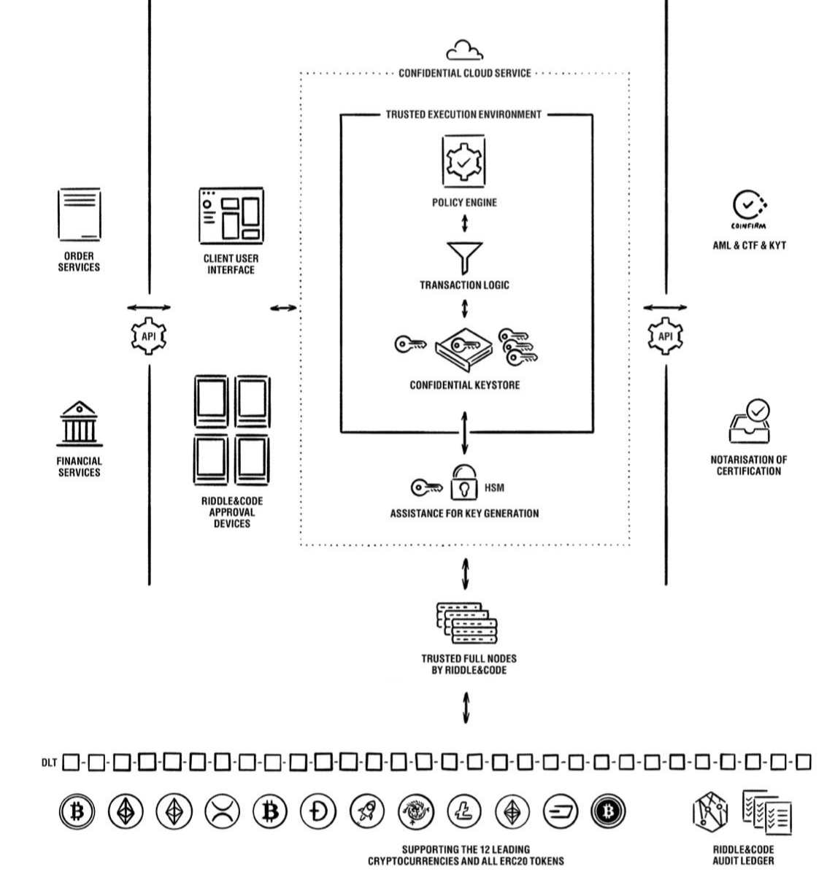

# Product Documentation
*Summary*

The Token Management Platform, a powerful yet simple all-in-one platform to store, transact and manage digital assets, contains the following components:

* Dedicated Approval Devices to access the solution, create transactions and approve the transactions based on tailor-made approval workflows.
* Confidential computing infrastructure to protect all sensitive operations and services.
* Segregated accounts and addresses managed by the Confidential Keystore
* Extended AML and full node service.
* Riddle&Code audit ledger that provides real-time, immutable audit trails of all critical operations.

RIDDLE&CODE’s Token Management Platform (TMP) combines hardware and software to store, secure and manage various digital asset categories. The solution provides multi-device approval workflows based on multi-approver policies. The TMP consists of the following components:

## Components

**Approval Devices**

Physical devices used for authentication and access to the web interface and transaction approval. Each Approval Device is secured by its own cryptographic identity and has the capability to limit the access and management of the settings and policies.

**Trusted Execution Environment (TEE)**

The TEE is a secure area of the main processor ensuring protection of the code and data loaded inside the processor. As an isolated execution environment, TEE provides integrity of applications operating within the TEE, along with confidentiality of their assets. In general terms, the TEE offers an execution space that provides a higher level of security than an operating system (OS) and more functionality than the Secure Element (SE). All critical components of the Token Management Platform are operated in a TEE.

**Transaction logic**

Transaction logic is a service to securely issue unsigned transactions, which are then signed by the Confidential Keystore.

**Confidential Keystore**

A cryptographically secured service running in a dedicated Trusted Execution Environment, the Confidential Keystore manages all operations related to the underlying keys and ensures secure key generation, storage and use.

**Design philosophy**

The multifunctional Token Management Platform allows the issuing of tokens, end-to-end trading, settlement and custody services with high levels of security, auditability and regulatory compliance.

The main components of this tokenization ecosystem are:

1. Key and identity management
2. Trusted Execution Environment (TEE)
3. Interoperability and regulatory compliance (APIs)

The following section describes each of these components.

## Key and identity management
Key management covers all aspects of generating, securing, exchanging/trading and revoking keys.

Since keys, private and public, act as a representation of indisputable identities, ownership of assets and proof-of-origin, a tokenization platform needs to provide all aspects to:

* create keys in a secure and auditable way,
* manage keys and related processes within a trusted and confidential environment,
* perform value or metadata transactions in a manner that meets the throughput and frequency requirements of mature industries, and
* enable revocation/withdrawal and re-creation of keys in the framework of key restoring and disaster management.

## Key generation
Key generation is performed in a secure and auditable way with no possibility for others to intercept or access the keys.

The keys are generated within a dedicated Approval Device and then exported to the Confidential Keystore via hardened, secure communication channels. A master key is then generated within the Trusted Execution Environment (TEE), which ensures the encryption of data in transit, while being processed and at rest.
Additional addresses are then derived from the master key within TEE. Following key generation, the key derivation path is defined according to the BIP-32, BIP-39, BIP-44 and additional applicable cryptocurrency standards. The BIP-32 protocol can turn the seed into a so-called mnemonic phrase that can be backed up according to a disaster recovery process.

**Once generated, keys need to be stored**

Once generated, keys are encrypted and stored to prevent malicious use. There are different approaches when it comes to ensuring that keys are securely stored.

In order to provide more accessibility and liquidity of assets, keys are often centralised in so-called hot wallets, from which all transactions either originate or depart. The advantage of these systems is that thousands of transactions per day can be carried out in dozens of digital currencies. This can be done in either an automated or, if necessary (depending on the total value of the transaction), a manual setup.

However, the disadvantage of these systems is a lack of security and transparency. Most major digital asset-related breaches are hot wallet breaches. In addition, the administration of digital currencies via classic databases and hot wallets also lacks regulatory suitability. The actual change of ownership isn’t documented in the blockchain. Instead, it’s stored and managed in classical databases by the exchanges for as long as the assets (keys) remain in custody.

Another way is to encrypt keys within HSMs to ensure that the keys are stored offline and never exposed to any malicious attack. Keys within an HSM can be decrypted only when predefined conditions are met. Yet, HSMs are designed to sign transactions on command, and, as such, they can be compelled to sign malicious transactions.

If HSMs have operational vulnerabilities and a hot wallet comes with security flaws, then how can keys be securely stored?
RIDDLE&CODE has developed its own solution to enable the combination of these techniques and has added the required orchestration and confidentiality.
The solution, named the Policy Gateway, combines flexibility and business logic with the protective power of hardware security models.

**Trusted Execution Environment (TEE)**

RIDDLE&CODE adopted the concept of confidential computing (CC) to protect its cloud services and data-in-use through isolating computations to a hardware-based Trusted Execution Environment (TEE).

This represents a secure location, isolated from the regular processing environment where the operating system and applications run. CC safeguards the confidentiality of data/code, protects its integrity and prevents unauthorised access to confidential data and malicious interference.

Without confidential computing, the cryptographic keys could be revoked, and the ownership of assets could become corrupted. Confidential computing can also achieve data compliance with legislation, such as GDPR or financial regulatory provisions. Finally, the most important aspect of RIDDLE&CODE’s approach to confidential computing is its implementation in a way that doesn’t increase the complexity for the user and, at the same time, remains cost-sensitive.

**Distributed ledger infrastructure**

Despite the groundbreaking improvements of distributed ledgers (immutability, distributed nature, consensus mechanisms, etc.) one of the fundamental issues of current blockchains is low throughput. This limitation has been a major impediment for an industry where scalability is a prerequisite to execute and perform thousands of transactions per second.
The results of low scalability are congested networks, high network fees, pending transactions and long confirmation times. Hence, the ledger infrastructure is not fit to cope with the vast number of transactions that can be expected once industry-wide adoption takes place. Just imagine all cars using car wallets and creating millions of transactions over the course of the day.  

It was the goal of RIDDLE&CODE to create a ledger network that is capable of coping with the requirements of future tokenization and the high load of transactions. BigchainDB is a ledger optimised for IoT applications that supports transaction throughput on par with global credit card networks. The ledger uses a proof-of-stake consensus mechanism and offers low latency, powerful query features, decentralised control, immutable data storage and extensive built-in cryptocurrency support.

The ledger is derived from IPDB and designed in such a way that it is completely GDPR compliant. The ledger itself contains no arbitrary data hashes as part of transactions that are signed off by public/private key pairs. Instead, it associates a piece of data with a storage identifier.

BigchainDB solves some of the fundamental weaknesses of existing ledgers by:

* achieving interoperability on the ‘infrastructure’ layer,
* managing metadata ‘roaming,’
* creating the right environment for business models to appear,
* supporting high enough performance/throughput to reach scale, and
* supporting offline/decentralised termination of transactions.

In combination with RIDDLE&CODE’s identity management/wallet solutions, confidential computing approach and interoperability with sidechains like Liquid, BigchainDB acts like an ‘engine’ that supports all aspects of tokenization, including the creation and issuance of tokens, management and trading, as well as burning the tokens in a fashion that is auditable and compliant with regulatory provisions.

**Interoperability and legal/regulatory compliance**

Decentralised systems require a high degree of interoperability of the various subsystems. In the future, many different blockchain networks will need to communicate and exchange data to form more complex and powerful networks.

In the domain of identity, interoperability is achieved by a broad range of crypto chips, HW/SW deployment options and support of the majority of relevant cryptographic algorithms. In the realm of confidential computing, this is achieved by combining certified and/or compliant technology with the ability to interact with other components in an agile way.

The BigchainDB ledger establishes the interoperability with other networks and technologies via peg-in/peg-out mechanisms. This allows the ledger to focus on its strength when it comes to storing identities and metadata while performing other functions via interoperability with specific sidechains, such as Liquid. In addition, a severe regime of recurring technical and process audits of our technology and the implementation of online audit trails via BigchainDB renders the Token Management Platform compliant with regulatory provisions.

## Key generation / key backup / disaster management

* This document describes the process of secure and confidential key generation, backup and recovery.
* RIDDLE&CODE’s Token Management Platform ensures that the entire process, from key generation and backup to key recovery, is entirely managed by the client.
* All key management-related operations are performed within the Trusted Execution Environment (TEE), which provides hardware-enforced code and data-in-use isolation.
* The client is the only entity that can access the Trusted Execution Environment and, therefore, has full ownership and control over the keys. RIDDLE&CODE, as the solution provider, does not have access to the keys and related processes at any time.
* Keys are generated in a secure and auditable way without a possibility for others to intercept or access the keys.
* The secure key recovery process can be performed in the case of disaster.
* RIDDLE&CODE provides a detailed step by step guide for performing secure and trusted key generation and recovery ceremonies: Key ceremony

Key management covers all aspects of the generation, securing, exchange/trading and revoking of keys. Since keys, private and public, act as a representation of indisputable identities, ownership of assets and proof-of-origin, key management needs to provide all aspects to:

* create keys in a secure and auditable way,
* manage keys and related processes within a trusted and confidential environment,
* perform value or metadata transactions to meet the throughput and frequency requirements of mature industries, and enable revocation/withdrawal and re-creation of keys in the framework of key restoring and disaster management.

### Key generation

*Fig 1: Key generation flow diagram*

1. To initiate the creation of the master key, a user (administrator) needs to trigger the key generation process on the web interface where the user will be led through the entire process, step-by-step.
2. The random number is created inside the Approval Device Secure Element and then exported to the Confidential Keystore via hardened, secure communication channels.
3. The Approval Device generates a mnemonic phrase for back up purposes
4. The phrase is displayed on the web interface to the user.
5. Finally, the user stores the mnemonic phrase on a steel plate.

Following the key generation, the key derivation path is defined according to the BIP-32, BIP-39, BIP-44 and additional applicable cryptocurrency standards. The BIP-32 protocol can turn the seed into a so-called mnemonic phrase that can be backed up according to a disaster recovery process.

### Security measures during the key generation process

The following safety and control measures are in place during the key generation process:
* **Confidential computing:**
  - Trusted Execution Environment ensures encryption of data in transit, while being processed and at rest.
  - Decentralised attestation enclaves and identities support a hardened authenticity and integrity verification process.
  - Secure and confidential execution within untrusted environments. (RIDDLE&CODE does not have any access to sensitive, confidential or encrypted data.)
  - Audit logs are created for all transactions and changes. Due to the integrity and authenticity of the solution, it can be guaranteed that these events are always recorded in a federated audit ledger.

* Audit logs for role-based access control and change management:
  - Physical protection of machines (TEE, HSM) via fingerprint readers, key and access control at data-center compliant with ISO-27001 standard.

* Hardened communication systems.

### The trusted source of entropy

The generation of keys is initiated with the following trusted independent source of randomness:

* The implemented hybrid random number generator complies with DRG.4 requirements, the highest security level for DRG. A physical quantum noise-based random number generator of the highest security class PTG.2 is used as the entropy source for seeding this deterministic random number generator.
* All TEE enclaves are also protected by being operated within a secure container environment called SCONE, enabling the confidential computing of container and host programs using dedicated TEEs
* The confidential computing setup supports Kubernetes, Docker and AZURE confidential computing, native LINUX hosts and Windows 10 Hyper V. This forms the basis of the Confidential Keystore as a Service (CKaaS) and offers trusted and confidential computing in combination with a classical HSM (e.g., SecuroSys or Utimaco) for managing and safekeeping of keys.
* Access to the HSM and CKaaS is defined by the role-based access and control system (RBAC) and enforced by hardware wallets (authentication & identity) and the Policy Layer (control). All processes are logged within classical Syslog-files and attested and stored to Riddle&Code ledger.
* Riddle&Code audit ledger provides real time and immutable record of all operations, including approved and rejected transactions, adding or disabling of policies and adding of trusted recipients. With Riddle&Code ledger, the client can decrypt, collect and analyse operational data processed within Token Management Platform and obtain real-time access to the respective audit logs. 

### Key backup and verification

After the key is created, the backup mnemonic phrase is disclosed to an administrator on the Approval Device that has been used to issued the secure seed generation. The mnemonic phrase consists of twenty-four words and is crucial to the backup and disaster recovery process for the entire Token Management Platform (TMP). It is used to restore keys in the case of loss or when a new initialisation of wallets is required. Due to its critical role in key management, the secret has to be safeguarded from malicious users. Here is RIDDLE&CODE’s recommendation for safely storing the phrase in the initialisation phase:

1. The user reads the phrase from Approval Device screen.
2. Next, the user writes down the mnemonic phrase on a steel plate and closes the plate.
3. The mnemonic phrase is stored in an off-premise vault.
This process is called a key ceremony.

**NOTE:** The backup of the mnemonic phrase is available only once, during the key ceremony. The mnemonic phrase cannot be retrieved later.

Once the mnemonic phrase is safely stored, it is time to perform the verification of the backup process. This process allows the client to verify the integrity of the mnemonic phrase and ensures that the keys being created by this mnemonic phrase equal the keys that are already in the system.

The backup process is done during the key ceremony:
1. The user verifies the parts of the mnemonic phrase on the Approval Device screen
2. The process continues until the mnemonic phrase is verified,

If the verification is successful, the backup mnemonic phrase can be trusted. The key ceremony is, therefore, completed.

**Disaster management**

Token Management Platform provides business continuity by ensuring that even in the case of a disaster scenario, such as bankruptcy or functional failure of RIDDLE&CODE, the keys are always under full control of the client.

**Key recovery process**

Key recovery can be triggered via the user interface, where the user will be led through the entire process, step-by-step:

1. The key recovery process starts by clicking the **Recover your keys** button on the web interface.
2. Twenty-four fields are displayed on the web interface.
3. The user then enters the mnemonic backup to the web interface and performs verification.
4. According to a strict protocol, part of the mnemonic phrase is re-injected into the Confidential Keystore, which ensures that an individual operator never knows the entire mnemonic phrase.
With this, the process is completed, and address generation and transaction signing capabilities per client are available.

**How is the data stored and accessed?**

Since DLT cannot delete data, the data is blinded, and the information is AES encrypted. This allows the design of regulatory compliant processes to adhere to GDPR or general accounting requirements. The RIDDLE&CODE solution manages the symmetric encryption keys. By design, RIDDLE&CODE’s solution changes the blinding key every calendar year. An administrator can export these keys and destroy a previously used key after several years (e.g., ten years). Not having the key is thus equal to not having the data.

* Administrators can export an AES key for a given year so that they can analyse the data on devices external to the RIDDLE&CODE solution. It is up to the administrator to decide how to secure the key.
* Administrators can delete a key and, thereby, access to the data, making it unusable and unavailable.
* Administrators can access encrypted ledger data via an interface so that the data can be decrypted and analysed locally.

## GDPR compliance

* Token Management Platform (TMP) is fully compliant with the General Data Protection Regulation (GDPR) requirements. The TMP associates all generated coin addresses with client accounts through an anonymous eight-digit account ID, ensuring that no personal data is stored within the solution. 
* All personal client data processed during onboarding is protected by the Data Protection Note and detailed in this document.

The Token Management Platform leverages the concept of confidential computing that ensures privacy by design and default. Changes processed by and within the system are registered and stored in compliance with GDPR requirements.

**General Data Protection Notice**

RIDDLE&CODE is committed to personal data protection. RIDDLE&CODE processes personal data in compliance with the relevant data protection regulations, in particular, the General Data Protection Regulation (GDPR, Regulation [EU] 2016/679) and the Austrian Data Protection Act (DSG). Any data processing by RIDDLE&CODE will, therefore, only take place within the scope of a legal basis, which will be stated below for the individual data processing operations. All employees of RIDDLE&CODE entrusted with data processing are obliged to maintain the confidentiality of the client’s data. No automated decision making is carried out.

**Transmission of personal data**
RIDDLE&CODE transmits personal data only to the extent necessary and only in the following cases:

* with consent;
* for the processing of contractual relationships or for the implementation of pre-contractual measures;
* when legally obliged to do so;
* to companies that support RIDDLE&CODE in providing services; these service providers act as processors, who may only process the data within the framework of a Data Processing Agreement;
* to protect a company’s legitimate interests (e.g., to assert, exercise or defend legal claims) or those of a third party.

In the cases mentioned above, the following third parties may come into consideration: contractual and business partners who are involved in the delivery or service (e.g., logistics companies), banks (for handling payment transactions), legal representatives, courts, auditors/tax consultants, administrative authorities, self-governing bodies (social insurance carriers) or insurance companies.

RIDDLE&CODE does not transfer a client’s personal data to third parties unless in specific cases where a party involved is domiciled in a third country (e.g., in the case of a client with headquarters outside the EU). If the data is transferred to a country without adequate data protection legislation, RIDDLE&CODE ensures an adequate level of protection by using suitable guarantees in the form of appropriate contracts (standard contractual clauses) or binding internal data protection regulations (Binding Corporate Rules) or by relying on the exceptional circumstances otherwise provided for in the GDPR (consent, execution of a contract, establishment, exercise or enforcement of legal claims, overriding public interests, already published personal data or to protect the integrity of data subjects). 

In this context, RIDDLE&CODE would also like to point out that any data voluntarily published by the clients about the company’s services is public and potentially accessible worldwide.

**Storing personal data**
Unless otherwise specified in the respective processing, RIDDLE&CODE stores personal data for as long as it is necessary to ensure the fulfillment of the aforementioned purposes or as long as we are legally obliged to do so.

The personal data of clients using Token Management Platform services are protected with segregation of accounts, which ensures that only duly authorised parties have access to the data relevant to them. This is done in a way that every individual account is protected with ID codes and mapped to coin addresses. The ID codes become part of the key derivation scheme and, therefore, part of the transaction data), creating a link between the assets and account holders. The TMP does not process or store any personal data, only the hash of the mapped account. 

Personal data that the client voluntarily provides will be stored by RIDDLE&CODE for the purpose of providing the associated processing and keeping records for up to 3 years after completion or termination, except when a longer storage period is required for the purpose of fulfilling a legal obligation or for the assertion or defense of legal claims.
Rights of the data subject
Provided that the respective legal requirements are met, the client can assert the following rights of data subjects:

Right to information: You can request confirmation as to whether personal data concerning you is being processed and request information about this data and the information pursuant to Art. 15 GDPR.

**Right of rectification** if RIDDLE&CODE processes incorrect or incomplete data about the client (Art. 16 GDPR).

**Right to have personal data concerning the client deleted** if the conditions of Art. 17 GDPR are met.

**Right to limit the processing of your data (Art. 18 GDPR).**

**Right to transfer the data provided by the client,** provided that the processing is based on consent (Art. 6 paragraph 1 letter a) or on a contract (Art. 6 paragraph 1 letter b) to which the client is party and that the processing is carried out using automated procedures (Art. 20 GDPR).

**Right to object to the processing of personal data**: When processing operations carried out on the basis of legitimate interests (pursuant to Art. 6 para. 1 letter of GDPR), the client has the right to object to the processing of personal data pursuant to Art. 21 GDPR, provided that there are reasons for doing so arising from a particular situation. When processing for the purpose of direct marketing, this right is unrestricted.

**Changes to our Data Protection Notice**
RIDDLE&CODE keeps its privacy policy up to date, adapting it when necessary. The current version of the company’s Data Protection Notice is available at https://www.riddleandcode.com/data-protection.

