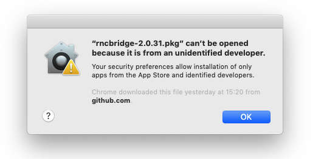
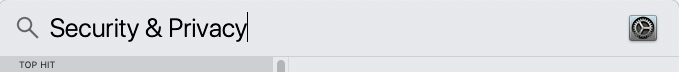
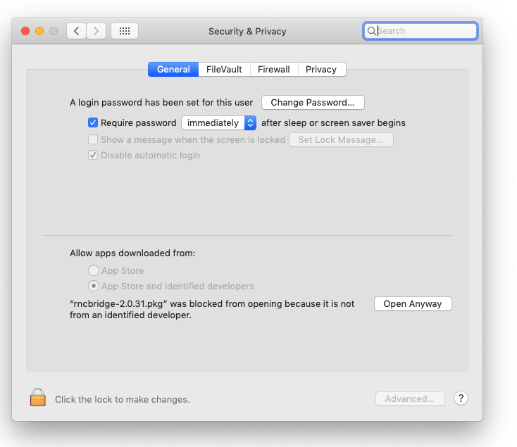
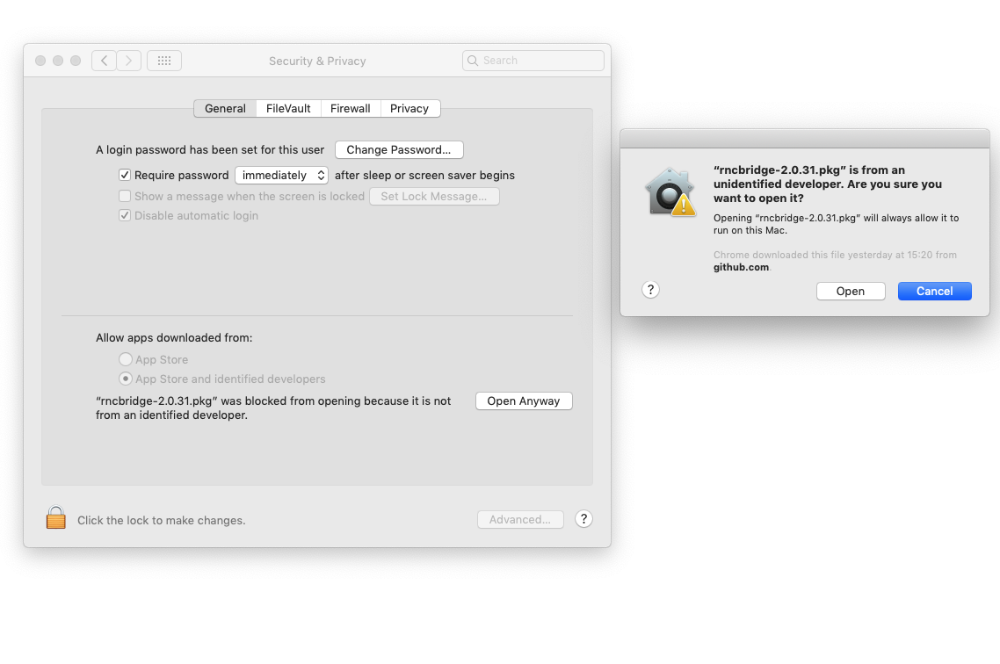
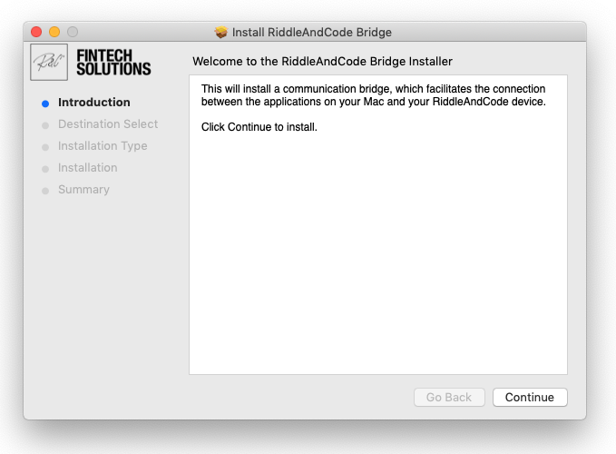
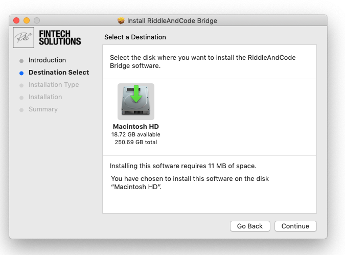
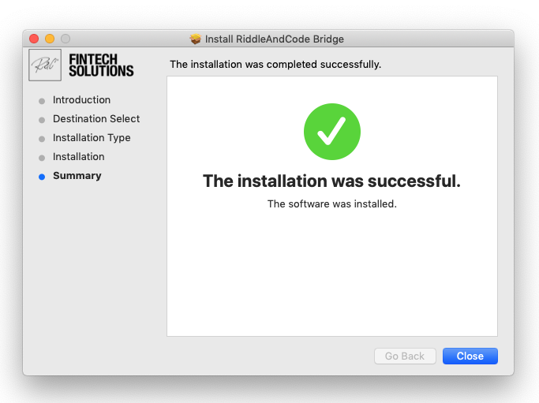

# Frequently Asked Questions

In this section, you can find answers to frequently asked questions.

1. Which operating systems are compatible with the TMP?

RIDDLE&CODEs Token Management Platform enables the best user experience on the following reference system:

` Windows 10 pro, OS build 19041.985 in combination with Chrome Version 91.0.4472.77 `

Other operating systems and browser configurations are untested and officially not recommended. Please reach out to your single point of contact at RIDDLE&CODE for any inquiries about other system and browser configurations.

2. My device is connected, but it doesn't seem to be paired. How can I fix this?

* First, ensure that your Approval Device is unlocked.
* Close the TMP browser window and then reopen it.

3. My device is paired and unlocked, but I still can't sign in. How can I fix this?

* Disconnect your Approval Device.
* Clear Chrome cache.
* Plug in and unlock your device.
* Now try to sign in again.

4. Which assets are currently supported?

Currently, the platform supports the following types of assets (and derivatives), where Bitcoin-forked or ERC-20 assets are counted as one type.

| Cryptocurrencies  | Supported tokens   |
|---|---|
| Bitcoin  | ERC-20  |  
| Ethereum  | ERC-165  |   
| Ripple | ERC-721 |   
| Litecoin | ERC-777 |
| Tether | ERC-1404 |
| Binance | ERC-1155 |
| Stellar | Atomic DSS |
| Cardano | T-REX |
| Monero | R-Token |
| Dash | DS-Token |
| Tezos | S3 (Open Finance) |
| IOTA | Ethereum Classic |
| NEM | Bitcoin Cash |
| Zcash | PIVX |
| Dogecoin | Wanchain |
| Decred | Fullcoin |
| Tendermint | Monacoin |
| Liquid | Zencash |
| Element | MaidSafeCoin |
| Qtum | Komodo |
| Corda | DigiByte |
| Lisk Augur | Ravencoin |

4. I am using a MacBook. Do I need to install any additional applications to access and use the TMP?

Yes, you will need to install the RIDDLE&CODE Bridge Service application. The steps are as follows:
* Download the RnC Bridge 2.0.31. You can find the latest version [here](https://riddlecode.app.box.com/s/ksud48m25jytzhrhcg81hay9c378jp0y).
* Next, run "rncbridge-2.0.31.pkg". You'll see that **Security and Privacy Centre** will block the action. This means that you have to save the app as an exception to the security settings.

* Open the **Security and Privacy** service on your MacBook.

* Navigate to *Allow apps downloaded from:*.

* Click **Open Anyway**. Confirm that you want to open the app.

* Start the installation process and follow the steps on the screen.

After the app is successfully installed, you are ready to access and use the Token Management Platform.

Couldn't find the answer? Please reach out to us at support@riddleandcode.com.
