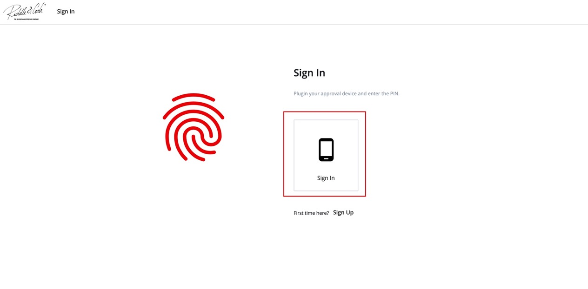

# Frequently Asked Questions 

This section covers the most common questions, Tips and Tricks we and our users encountered while working with the Token Management Platform. 

* Question: My device is connected but doesn't seem to be paired

1. Ensure your device is unlocked 
2. Close the TMP browser window and reopen the page.

* Question: My device is paired and unlocked but I can't seem to sign in. 

1. Disconnect the device
2. Empty your Chrome cache 
3. Plug in your device and unlock again 
4. Now try to sign in again. 

* Question: I have a new device what do it do now?

Access to the web interface is granted to pre-registered devices only. To access the web interface:

1. Plugin your Approval Device to the computer,
2. Open the Sign-in page by clicking on the link: https://yourcompanyname-ck.r3c.network/signin,
3. Click **Sign in,**

4. Enter your PIN on the device.

In the case something is missing, please reach out to us at support@riddleandcode.com