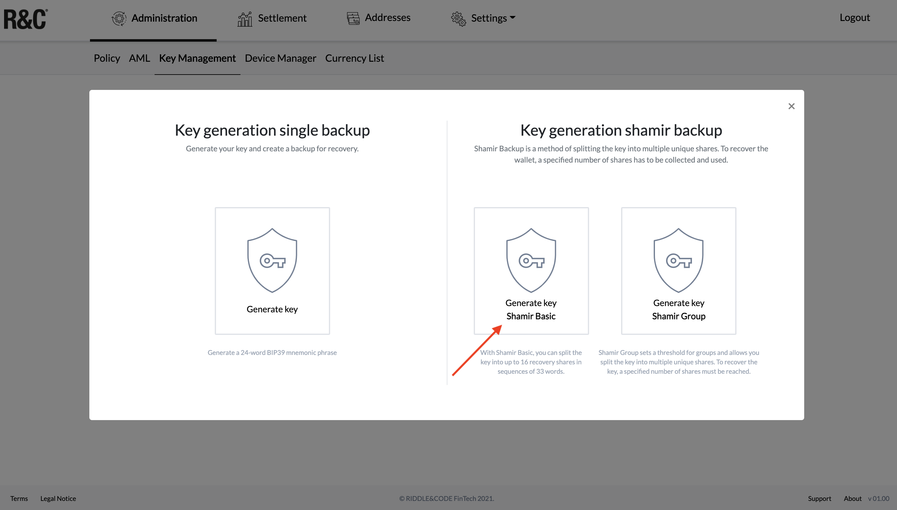

# Key ceremony based on SLIP-0039 and Shamir Basic backup

**Summary**:
* This document describes a key ceremony protocol designed to secure the most crucial part of the Token Management Platform – the seed used to generate the initial key pair – and minimise the attack surface.
* Please read this document in full before starting the ceremony. Revise it carefully and verify that it complies with your safety practices, procedures/requirements and operational processes.
* **Chapter 1** describes the basic concepts of the key ceremony, including the importance of private/public keys and RIDDLE&CODE’s safety recommendations when performing the ceremony.
* **Chapter 2** lists all the equipment necessary to conduct the ceremony, such as steel plates and an Approval Device.
* **Chapter 3** will guide you through the key generation process with step-by-step instructions.
* Finally, **Chapter 4** will show you how to restore the key.

## Chapter 1: Introduction to the key ceremony

Keys (private/public) are the foundation of each business case or application built upon blockchain. Whoever controls the keys also owns and controls the digital assets. Therefore, the key ceremony, which includes key generation and backup, is the most critical procedure to guarantee security and control over the assets. There are different ways to execute a key ceremony. Among other methods, [RIDDLE&CODE uses Shamir’s Secret Sharing scheme](https://docs.riddleandcode.com/Shamir-based-key-generation/).

RIDDLE&CODE recommends performing the key ceremony only once you are acquainted with the related safety protocol. Therefore, you should run one or two test ceremonies using pieces of paper instead of actual steel plates.

In case of any unclarities or questions, please contact RIDDLE&CODE at support@riddleandcode.com.

## Chapter 2: Equipment necessary to perform the key ceremony

You will need the following:
* Approval Device – seed edition

* A reliable computer with access to the internet
    * RIDDLE&CODE recommends using Chrome on Windows, at least version 91.0.
* Steel plates (the number of steel plates will depend on the number of participants)
* 1 metal engraving tool
* Metal boxes (or something similar) to store the steel plates
* Access to your TMP installation (e.g. https://yourcompanyname-tmp.r3c.network)

### Mnemonic phrase

The mnemonic phrase consists of 33 words and follows the [SLIP-0039 standard](https://github.com/satoshilabs/slips/blob/master/slip-0039.md). To re-create a wallet and access funds, the words comprising the mnemonic phrase must follow the correct, previously established, sequence. The very last word always functions as a control word, validating the consistency of the original phrase.

For storing the mnemonic phrase, RIDDLE&CODE recommends the following:
* Steel plates should be stored in separate physical locations.
* When filling out the steel plates, no person should be able to see another person’s words.
* Everyone participating in the key ceremony should become familiar with basic steel plate operations such as opening, closing, turning them over and engraving the words.

### The plates
Each share is backed up using 2 steel plates, with both plates stored in a metal box and sealed with a security seal. A single plate stores 24 words, 12 on each side. Each side has 3 rows, with 4 words in each row.
All plates should rest on a flat, non-transparent surface so that, when used, only one side is readable. Cover the plates when turning them over and mark them with an engraved identifier so that you know which plate contains which words. For example, you could name the shares Alpha, Beta, Gamma, Delta, Epsilon, etc.

### The master of ceremony
The master of ceremony is responsible for handing the plates to each participant and ensuring that no participant will turn them over unless as part of the procedure. Although orchestrating the whole process, the master of ceremony never sees any of the words. If this procedure is not followed correctly, the master of ceremony is obligated to stop it and start anew.

**NOTE**: The key ceremony can be filmed to prove that there was no collusion between the participants. Please note that the film camera needs to be positioned in such a way that at no point in time, the screen of the Approval Device is visible.
The ceremony usually takes around two hours from start to finish. Please ensure that all participants are available during this period. Due to the importance of this procedure, RIDDLE&CODE recommends performing the ceremony in a separate room without cameras. Participants are not allowed to have cameras, mobile phones or any other recording devices with them.

During the ceremony, you will use steel plates to store a mnemonic phrase. The key will be split into shares among a defined number of participants. Each share will contain a 33-word mnemonic phrase. In other words, each participant stores one complete 33-word backup. You will need two steel plates to store a 33-word backup. The number of steel plates will depend on the number of participants. For instance, you will need 10 steel plates if there are 5 participants.

This method guarantees confidentiality since no one individual will be able to recreate the entire secret and obtain control over the assets. And if some steel plates are missing, the mnemonic phrase can still be recovered.

## Chapter 3: The key ceremony guidelines

The master of ceremony gathers all the participants (including an administrator) and prepares an Approval Device, steel plates and metal boxes.

The administrator signs in to the dedicated interface via a link provided by RIDDLE&CODE. Next, the administrator connects the Approval Device – seed generation – to a computer and unlocks the device with the PIN (default PIN: 234).

To start the key ceremony, the administrator needs to trigger the generation of the mnemonic phrase via the web interface. The steps are as follows:
* Visit Administration -> Key Management.

* Click Generate new key.

* Choose to continue with Shamir Basic.

This will trigger the generation of a true random number and, subsequently, a mnemonic phrase, which then needs to be backed up and stored on the steel plates.

The steps for the master of key ceremony are as follows:
* Confirm on your Approval Device that you want to create a backup.
* Now, you need to set the number of shares, from 1 up to 16. Each recovery share will consist of 33 words. Set the preferred number of shares and tap the **Continue** button to proceed.
* Next, you need to set the threshold required to recover the key from your shares. The maximum threshold is the total number of generated shares (e.g. 5 of 5 or 16 of 16). The minimum threshold is 2. Any of the generated shares can be used to fulfil the threshold. Tap **Continue**.

The Approval Device will now display the words of the first recovery share. The first participant of the ceremony needs to write down the words in the presented order. The steps are as follows:
1. The master of ceremony is left alone with the first participant.
2. The master of ceremony prepares two (2) empty plates and hands them to the participant, together with the engraving tool.
3. The participant reads the words and transcribes them to the plate.
4. The participant swipes down to reveal the next set of words and transcribes them to the plate.
5. After the 24th word is transcribed, the participant continues with the second plate to store the words 25 to 33.
6. Once the participant has noted down all the words, he/she will be asked to verify their backup.
7. The Approval Device will request to identify and select the correct word out of a selection of three words. Check the steel plates to pick the right word and continue.
8. Continue with verifying backup until the Approval Device displays the confirmation and moves to the next share.
9. Once all steps are completed, the participant locks the two steel plates in the prepared box.

Next, the master of ceremony asks the first participant to leave the room, and the next participant enters.
The other participants repeat the same procedure with their shares, until all five shares are written down, backed up and stored in their respective boxes. A success message is displayed on the interface and you will be presented with a public key that you can note down for further references.

Once you have generated and backed up the phrase, it is recommended to perform key backup recovery. This process assures that all steel plates contain the correct words and that the shares can be used to recover the underlying keys.

## Chapter 4: Recovering key backup
The process is performed with the steel plates, the same master of ceremony and, typically, the previous participants. The master of ceremony is responsible for handing out the correct plates to each participant. You can randomly pick the shares to be used for the recovery.

The recovery process follows similar steps to the initial key generation. The master of ceremony prepares the steel plates and a new/unused Approval Device that is registered as the administrator’s. The steps are as follows:
* The administrator starts the process by accessing the interface and navigating to Administration -> Key Management.

* The administrator then clicks Recover key backup.

* Click Continue. Now you need the Approval Device. Please make sure that the device is connected to the computer and unlocked.
* Start entering the shares by typing the words of the recovery share in the order specified on the device.
* Confirm that the word is correct by clicking on it. After successfully entering the first share, the device will recognise the necessary threshold and display how many shares you still need to enter.
* Tap on **Enter share** to start entering the next share. Recovery shares can be entered in any order. However, the words of the recovery shares have to be entered in the existing specified order.  
* Continue entering the recovery shares until the threshold is reached, when you will then see a confirmation message on your device.

The public key of the mnemonic phrase will be displayed on the interface. This key can be compared and verified against the one generated in the initial key generation process. If these public keys match, the original mnemonic phrase has been entered correctly.

This concludes the guide for secure execution of the key ceremony. If there are any questions or concerns, please contact **support@riddleandcode.com**.
