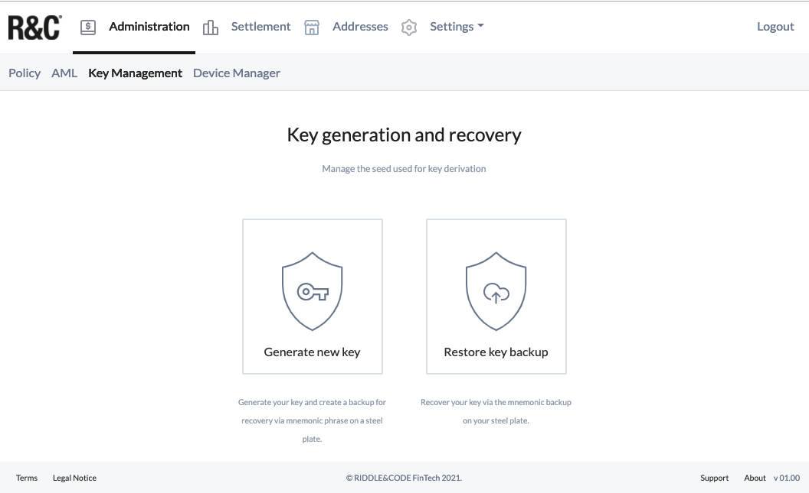
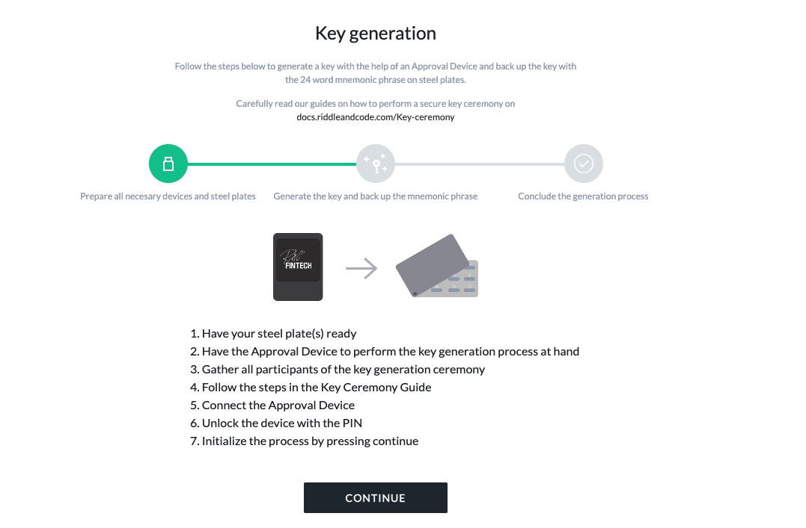

# Two participants and two plates

## Summary:

- This document describes a key ceremony protocol designed to secure the most crucial part of the Token Management Platform—the seed used to generate the initial key pair—and minimise the attack surface.
- Please read this document in full before starting the ceremony. Revise it carefully and verify that it complies with your safety practices, compliance procedures/requirements and operational processes.
- Chapter 1 describes the basic concepts of the key ceremony, including the importance of private/public keys and RIDDLE&CODE’s safety recommendations when performing the ceremony.
- Chapter 2 lists all the equipment necessary to conduct the ceremony, such as steel plates, Approval devices and more.
- Chapter 3 will guide you through the key ceremony process with step-by-step instructions.
- In Chapter 4 you will learn how to validate the mnemonic phrase.
- Finally, Chapter 5 will show you how to restore the phrase.

<<<<<<< HEAD
##Chapter 1: Introduction to the key ceremony
=======

## Chapter 1: Introduction to the key ceremony
>>>>>>> 6af76499450da828a693a48446eb4b7a453c1c14

Keys (private/public) are the foundation of each business case or application built upon blockchain. Whoever controls the keys, also owns and controls the digital assets. Therefore, the key ceremony is the most critical procedure to guarantee security and control over the assets.

There are different ways a key ceremony can be executed. In this document, we give our recommendations on performing a ceremony based on experiences and requirements from the Swiss banking industry. In this specific example, the ceremony is performed with a master of ceremony, two participants and two plates.

RIDDLE&CODE’s recommendation is to perform the key ceremony only after you get acquainted with the related safety protocol. Therefore, you should run one or two test ceremonies using pieces of paper instead of actual steel plates.

In case of any unclarities or questions, please contact RIDDLE&CODE at **support@riddleandcode.com**.

##Chapter 2: Equipment necessary to perform the key ceremony

You will need the following:

- The Approval Device - Seed edition.

- A reliable computer with access to the Internet. RIDDLE&CODE recommends using Chrome, at least version 87.0.
- 2 steel plates.

- 2 locks that fit the steel plates.
- A set of tweezers to help you with inserting the letters in the steel plates.
- A flat screwdriver (or something similar) to open the steel plates’ barrier (they lock the letters into place).

**NOTE**: The ceremony usually takes around two hours to finish. Please ensure that all participants in the ceremony are available during this period.

Due to the importance of this procedure, RIDDLE&CODE recommends performing the ceremony in a separate room without cameras. Participants are not allowed to have cameras, mobile phones or any other recording devices with them.

During the ceremony, you will use two steel plates to store mnemonic phrase. This way, confidentiality is guaranteed since no single person will ever see or hold the entire mnemonic phrase. And in case that one steel plate is missing, the mnemonic phrase can still be recovered.

### Mnemonic phrase

To initiate the key ceremony, a user needs to trigger the generation of a secure seed via the web interface.

A random number is created inside the Approval Device and then exported to the Confidential Keystore via hardened, secure communication channels.
This random number represents a 32-byte sequence as a 256-bit number and stores all the information necessary to recover a wallet and hence, assets. However, since a 32-byte sequence would be difficult to remember or write down, the concept of a human-readable and memorisable mnemonic phrase has been introduced.

The mnemonic phrase consists of 24 words defined according to the Bitcoin improvement proposal numbered BIP-32, BIP-39, BIP-44 and additional applicable cryptocurrency standards. To recreate a wallet and access funds, the words comprising the mnemonic phrase must follow the correct, previously established sequence. The very last word always functions as a control word, validating the consistency of the original phrase.

RIDDLE&CODE’s recommendation for storing the mnemonic phrase is:

- No single person should know the whole mnemonic phrase. This ensures that no individual can re-create the entire secret and obtain control over assets.
- Steel plates should be stored in separate physical locations.
- When filling out the steel plates, no person should be able to see another person’s words.

### The plates

Each plate is sealed with a lock. A single plate stores 24 words, 12 on each side. Each side has 3 rows, with 4 words in each row. 

All plates should rest on a flat, non-transparent surface so that when open, only one side is readable. When turning a plate on the opposite side, the plate should always be closed. The sides can be marked with a removable sticker so that during the validation of the phrase, you will know which plate contains which words.

Our recommendation is that everyone participating in the key ceremony become familiar with basic steel plate operations such as opening, closing, turning them over, inserting the letters, etc.

### Master of ceremony

The master of ceremony is responsible for handing the plates to each participant and ensuring that no participant will turn them over unless as part of the procedure.

In case that procedure is not being followed correctly, the master of ceremony is obligated to stop it and start anew. Although orchestrating the whole process, the master of ceremony never sees any of the words.

**NOTE**: The key ceremony can be filmed to prove that there was no collusion between the two participants. Please note that the film camera needs to be positioned in such a way that at no point in time, the screen of the Approval Device is visible.

## Chapter 3: The key ceremony guidelines

The master of ceremony gathers all participants (among them is an administrator) and prepares one Approval Device, two steel plates, two locks that fit the steel plates, a set of tweezers to help with inserting the letters in the steel plates and a flat screwdriver (or something similar).

The administrator signs in to the dedicated interface via provided link: **https://<company-name>-ckm.r3c.network/**.
The administrator connects the Approval Device - Seed generation to a computer, unlocks the device with the PIN (default PIN: 234) and clicks **Generate new master seed**.

This will trigger the generation of a true random number—mnemonic phrase, which then needs to be stored on the steel plates. The Approval Device remains connected to a computer during the entire process.

### First participant

- The master of ceremony is left alone with the first participant.
- The master of ceremony opens the plates A and B, which contain no words.
- The first participant clicks the button on the Approval Device. The first 12 words are displayed one after the other.
- The first participant reads the words and transcribes them to plates A and B, in words 1 to 12 (the first, second and the third row).
- After the 12th word is stored, the first participant closes plates A and B and marks them with “ALPHA.”
- Next, the master of the ceremony asks the first participant to leave the room, and the second participant enters.

### Second participant

- The master of ceremony opens the plate A, which contains no words on positions 13 to 24.
- The second participant clicks on the Approval Device and privately reads the next 12 words.
- The participant writes them down in plates A and B using the available slots 13 to 24 (the first, second and third row).
- The second participant marks the sides as “BETA” and turns over the plates to the master of ceremony.
- The plates A and B are completed.

Once you have generated and stored the phrase, it is time to perform a process called mnemonic validation. This process assures that all steel plates contain the correct words and that the mnemonic phrase can be used to recover the underlying keys. If mnemonic validation is not performed, there is no guarantee that you will be able to restore a mnemonic phrase.

## Chapter 4: Mnemonic phrase validation

Mnemonic validation is performed with steel plates marked with the stickers by the same master of ceremony and, typically, the previous participants.
The master of ceremony is responsible for handing out the correct plates to each participant and ensuring that the same side of the plate is not used twice.
The master of ceremony should also ensure that none of the participants turn the plates to read the opposite side.

### Mnemonic phrase validation steps

The validation process is performed with the Approval Device. You will be asked to choose the correct words from a numbered list of 3 words until at up to 8 words have been correctly verified. The master of ceremony is tasked with guiding the process.

Please find below an exemplary description of the process:
- The master of ceremony initiates the verification process by pressing the button on the Approval Device.
- The Approval device displays 3 words and asks which one of them is on position x of the backup.
- The master of ceremony asks the participant to open the steel plate and enter the correct word on the position x. Each word displayed on the Approval Device needs to match with the corresponding word on the steel plates.
- After completing the validation process, the Approval Device provides a success message and the web interface displays the Pubkey of the master seed.

## Chapter 5: Restore mnemonic phrase
In cases of disaster, for instance, when the cloud service gets destroyed, the Approval Devices end up stolen, RIDDLE&CODE shuts down its business or any other event that might jeopardise the access to the base keys, the key restoral process guarantees that a company or individual can re-create the secret and hence the control over digital assets. Besides, if the user decides to use another digital asset management tool or system, the keys can be restored independently of RIDDLE&CODE.

The recovery process follows similar steps as the initial key generation. The master of ceremony prepares the steel plates and a new/unused Approval Device. All participants in the ceremony need to be present.

The administrator starts the process by accessing the web interface and navigating to the **Key Management** section. The administrator then clicks **Restore master seed backup**. Next, the administrator connects the Approval Device to the computer, unlocks it with PIN and clicks **Initialize now**.

The hash of the mnemonic phrase is displayed on the interface. The hash can be compared and verified against the one stored in the initial key generation process—if you open a steel plate, you’ll see that it has 2 sides with 12 words. Each plate contains the mnemonic phrase as a whole. If these hashes match, the original mnemonic phrase has been entered correctly.

This concludes the guide for secure execution of the key ceremony. If there are any questions or concerns, please contact **support@riddleandcode.com**.
