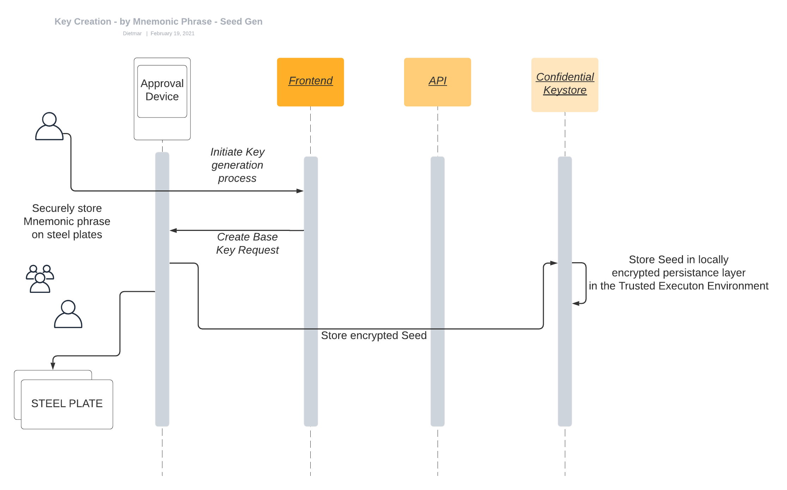

*Summary*

The Token Management Platform, a powerful yet simple all-in-one platform to store, transact and manage digital assets, contains the following components:

* Dedicated Approval Devices to access the solution, create transactions and approve the transactions based on tailor-made approval workflows.
* Confidential computing infrastructure to protect all sensitive operations and services.
* Segregated accounts and addresses managed by the Confidential Keystore
* Extended AML and full node service.
* Riddle&Code audit ledger that provides real-time, immutable audit trails of all critical operations.

RIDDLE&CODE’s Token Management Platform (TMP) combines hardware and software to store, secure and manage various digital asset categories. The solution provides multi-device approval workflows based on multi-approver policies. The TMP consists of the following components:

#### Components

**Order Services**

Integration with existing client systems for the creation and management of digital asset orders.

**Financial Services**

Interfaces to existing information and core banking systems.

**Client (user) interface**

Dedicated web interface providing access to all essential operations of the Digital Asset Management Solution. It separates roles between administration and execution and facilitates operations, such as initial set-up, user onboarding and revoking, multiple approval configuration, policy management, key and address management, transaction signatures, validation, execution and broadcasting signed transactions to blockchain networks.

**Approval Devices**

Physical devices used for authentication and access to the web interface and transaction approval. Each Approval Device is secured by its own cryptographic identity and has the capability to limit the access and management of the settings and policies.

**Trusted Execution Environment (TEE)**

The TEE is a secure area of the main processor ensuring protection of the code and data loaded inside the processor. As an isolated execution environment, TEE provides integrity of applications operating within the TEE, along with confidentiality of their assets. In general terms, the TEE offers an execution space that provides a higher level of security than an operating system (OS) and more functionality than the Secure Element (SE). All critical components of the Token Management Platform are operated in a TEE.

**Policy Layer**

Token Management Platform provides clients with a TEE cloud solution that has a specific Policy Layer that regulates, protects and logs every type of transaction. The Policy Layer is an integral part of a universal signing server, and it is implemented using dedicated machines featuring a Trusted Execution Environment (TEE). A TEE encapsulates the program and related access keys in a specific hardware-protected memory area in the processor core.

The Policy Layer is comprised of:
* a logic to evaluate and verify a given policy set,
* a set of policies defined by the client to govern the creation and execution of transactions, and
* an API to administer the set of policies and access permissions.

**Transaction logic**

Transaction logic is a service to securely issue unsigned transactions, which are then signed by the Confidential Keystore.

**Confidential Keystore**

A cryptographically secured service running in a dedicated Trusted Execution Environment, the Confidential Keystore manages all operations related to the underlying keys and ensures secure key generation, storage and use.

**Notarisation Service**

RIDDLE&CODE integrates a dedicated notarisation and certification tracking solution to create, attest and track digital certificates across their lifecycle.

**Design philosophy**

The multifunctional Token Management Platform allows the issuing of tokens, end-to-end trading, settlement and custody services with high levels of security, auditability and regulatory compliance.

The main components of this tokenization ecosystem are:

1. Key and identity management
2. Trusted Execution Environment (TEE)
3. Distributed ledger infrastructure
4. Policy Layer
5. Interoperability and regulatory compliance (APIs)

The following section describes each of these components.

#### Key and identity management
Key management covers all aspects of generating, securing, exchanging/trading and revoking keys.

Since keys, private and public, act as a representation of indisputable identities, ownership of assets and proof-of-origin, a tokenization platform needs to provide all aspects to:

* create keys in a secure and auditable way,
* manage keys and related processes within a trusted and confidential environment,
* perform value or metadata transactions in a manner that meets the throughput and frequency requirements of mature industries, and
* enable revocation/withdrawal and re-creation of keys in the framework of key restoring and disaster management.

##### Key generation
Key generation is performed in a secure and auditable way with no possibility for others to intercept or access the keys.
The keys are generated within HSM and then exported to the Confidential Keystore via hardened, secure communication channels. A master key is then generated within the Trusted Execution Environment (TEE), which ensures the encryption of data in transit, while being processed and at rest.
Additional addresses are then derived from the master key within TEE. Following key generation, the key derivation path is defined according to the BIP-32, BIP-39, BIP-44 and additional applicable cryptocurrency standards. The BIP-32 protocol can turn the seed into a so-called mnemonic phrase that can be backed up according to a disaster recovery process.

**Once generated, keys need to be stored**

Once generated, keys are encrypted and stored to prevent malicious use. There are different approaches when it comes to ensuring that keys are securely stored.

In order to provide more accessibility and liquidity of assets, keys are often centralised in so-called hot wallets, from which all transactions either originate or depart. The advantage of these systems is that thousands of transactions per day can be carried out in dozens of digital currencies. This can be done in either an automated or, if necessary (depending on the total value of the transaction), a manual setup.

However, the disadvantage of these systems is a lack of security and transparency. Most major digital asset-related breaches are hot wallet breaches. In addition, the administration of digital currencies via classic databases and hot wallets also lacks regulatory suitability. The actual change of ownership isn’t documented in the blockchain. Instead, it’s stored and managed in classical databases by the exchanges for as long as the assets (keys) remain in custody.

Another way is to encrypt keys within HSMs to ensure that the keys are stored offline and never exposed to any malicious attack. Keys within an HSM can be decrypted only when predefined conditions are met. Yet, HSMs are designed to sign transactions on command, and, as such, they can be compelled to sign malicious transactions.

If HSMs have operational vulnerabilities and a hot wallet comes with security flaws, then how can keys be securely stored?
RIDDLE&CODE has developed its own solution to enable the combination of these techniques and has added the required orchestration and confidentiality.
The solution, named the Policy Gateway, combines flexibility and business logic with the protective power of hardware security models.

**Trusted Execution Environment (TEE)**

RIDDLE&CODE adopted the concept of confidential computing (CC) to protect its cloud services and data-in-use through isolating computations to a hardware-based Trusted Execution Environment (TEE).

This represents a secure location, isolated from the regular processing environment where the operating system and applications run. CC safeguards the confidentiality of data/code, protects its integrity and prevents unauthorised access to confidential data and malicious interference.

Without confidential computing, the cryptographic keys could be revoked, and the ownership of assets could become corrupted. Confidential computing can also achieve data compliance with legislation, such as GDPR or financial regulatory provisions. Finally, the most important aspect of RIDDLE&CODE’s approach to confidential computing is its implementation in a way that doesn’t increase the complexity for the user and, at the same time, remains cost-sensitive.

**Distributed ledger infrastructure**

Despite the groundbreaking improvements of distributed ledgers (immutability, distributed nature, consensus mechanisms, etc.) one of the fundamental issues of current blockchains is low throughput. This limitation has been a major impediment for an industry where scalability is a prerequisite to execute and perform thousands of transactions per second.
The results of low scalability are congested networks, high network fees, pending transactions and long confirmation times. Hence, the ledger infrastructure is not fit to cope with the vast number of transactions that can be expected once industry-wide adoption takes place. Just imagine all cars using car wallets and creating millions of transactions over the course of the day.  

It was the goal of RIDDLE&CODE to create a ledger network that is capable of coping with the requirements of future tokenization and the high load of transactions. BigchainDB is a ledger optimised for IoT applications that supports transaction throughput on par with global credit card networks. The ledger uses a proof-of-stake consensus mechanism and offers low latency, powerful query features, decentralised control, immutable data storage and extensive built-in cryptocurrency support.

The ledger is derived from IPDB and designed in such a way that it is completely GDPR compliant. The ledger itself contains no arbitrary data hashes as part of transactions that are signed off by public/private key pairs. Instead, it associates a piece of data with a storage identifier.

BigchainDB solves some of the fundamental weaknesses of existing ledgers by:

* achieving interoperability on the ‘infrastructure’ layer,
* managing metadata ‘roaming,’
* creating the right environment for business models to appear,
* supporting high enough performance/throughput to reach scale, and
* supporting offline/decentralised termination of transactions.

In combination with RIDDLE&CODE’s identity management/wallet solutions, confidential computing approach and interoperability with sidechains like Liquid, BigchainDB acts like an ‘engine’ that supports all aspects of tokenization, including the creation and issuance of tokens, management and trading, as well as burning the tokens in a fashion that is auditable and compliant with regulatory provisions.

### Policy layer
The Policy Layer is a set of rules that performs and logs all processes preceding and following transaction authentication. It verifies that the defined roles and rules are imposed and specifies the access rights to the platform and any of its functionalities.

**CHALLENGE 1**
> Fullfilling regulatory criteria for transparency and compliance.

***Solution via POLICY LAYER***

Verifies that the defined roles and rules are imposed and followed in a cryptographically secured way. The Policy Layer provides trails of all conducted operations, including details like which changes have been made, who made those changes, who signed the transaction, the place and time, the amount, the fees, the accounts involved, etc.
With policies that are fully auditable and written in a human-readable language, audit trails become the trusted source, validating that all operations were done in compliance with regulatory frameworks.

**CHALLENGE 2** 
> Ensuring that transaction governance is secure and immutable.

***Solution via Policy Layer***

Allows clients to set role-based access control in the operational processes and define the access rights to the Token Management Platform and any of its functionalities. For example, separation of roles can be among administrators and operators. Administrators are the only ones who can create and customise transaction rules, ensuring that no circumvention is possible.

**CHALLENGE 3**
> Preventing internal misuse.

***Solution via POLICY LAYER***

Allows defining of approval rules for signing transactions according to different parameters. Every new transaction can be executed only if it complies with previously set rules. If any of the rules are not followed, the Policy Layer declines the approval and rejects the transaction. This enables clients to approve and execute transactions following tailor-made, cryptographically secured approval rules and prevents internal misuse.

**See it in action**

1. **Define roles.** Client sets the segregation of roles between departments and their roles in the operations. For example, an administrator can pick the approval group and pre-approve transactions based on the involved users.

2. **Set rules.** Policies are defined by rules and can be customised only by the administrators utilising the multiparty computation security concept. The rules can be based on different factors, including the number of transfers, signatures, maximum amount per transaction, per-period limit, etc.

3. **Sign transaction.** Every new transaction is filtered through the Policy Layer, which matches the requirements for the transactions with the existing policies. If all rules applicable for the transaction are adhered to, the Policy Layer accepts and executes the transaction.

**Examples of policies**

| Policy | Description |
|-|-|
| Threshold | Defines the maximum amount allowed per transaction for a certain user group. For example, the operators can approve an amount below 50,000 euros, but transactions above this threshold require additional approval. |
| Authorised users per amount | Defines user groups that are allowed to participate in transaction approvals. |

**Interoperability and legal/regulatory compliance**

Decentralised systems require a high degree of interoperability of the various subsystems. In the future, many different blockchain networks will need to communicate and exchange data to form more complex and powerful networks.

In the domain of identity, interoperability is achieved by a broad range of crypto chips, HW/SW deployment options and support of the majority of relevant cryptographic algorithms. In the realm of confidential computing, this is achieved by combining certified and/or compliant technology with the ability to interact with other components in an agile way.

The BigchainDB ledger establishes the interoperability with other networks and technologies via peg-in/peg-out mechanisms. This allows the ledger to focus on its strength when it comes to storing identities and metadata while performing other functions via interoperability with specific sidechains, such as Liquid. In addition, a severe regime of recurring technical and process audits of our technology and the implementation of online audit trails via BigchainDB renders the Token Management Platform compliant with regulatory provisions.

### Approval Devices

* This document describes how the Token Management Platform uses dedicated Approval Devices to identify users and their roles in the operations. It also describes the operations and actions that clients can perform with Approval Devices.
* Token Management Platform (TMP) is a cloud-based service that secures and stores the keys necessary to sign transactions. To guarantee that the client has full control over the authorisation and signing process, RIDDLE&CODE developed the Approval Devices. The devices are held by the client on the premises and by the authorised personnel of the organisation.

* **Note:** Approval Devices are highly-sophisticated cryptographically secured devices that follow the E2E security approach and the four-eye principle. In the next paragraphs, we explain the Approval Devices’ design philosophy and purpose.

*Fig.1 Approval device*

Approval Devices are physical devices used for authentication and access to the web interface and for providing secure and trusted approval capabilities. Each Approval Device is secured by its own cryptographic identity, with the capability to limit the access and management of operations, settings and policies. Clients connect the Approval Device to their individual computers. All communication channels between the devices and the core components of the TMP are hardened and encrypted.

The Approval Devices have the following functions:

1. authentication and access to the TMP,
2. management of critical functionalities like Policy Layer rules, and
3. approval of transactions.

There are two types of authentication methods used to guarantee that only authorised Approval Devices and users can access the TMP:

1. FIDO 2 for authentication of the device, and
2. PIN for authentication of the user.

**RIDDLE&CODE’s Secure Element**

At the core of the Approval Devices is a dedicated Secure Element, a part of RIDDLE&CODE’s “Built for Blockchain” product range featuring a dedicated CC EAL 6+ compliant crypto accelerator and crypto storage chips, which enable secure storage of the digital identity (private key) on any given device through the combination of hardware and software. The TMP’ Policy Layer checks against the Secure Element and its identity for each transaction to guarantee that only authorised devices can create and approve transactions.

The devices support modern cryptographic algorithms that are focused around Elliptic Curve cryptography. The core integrity of the Approval Devices is defined by the cryptographic private-public key pair that is defined on the cryptographic processor during its first initialisation (TRNG).

**Design philosophy**

These tamper-evident devices are developed as an industrial-grade cryptocurrency wallet to support trading and identity management. The following principles have been implemented during the development and design of the device:

* zero-trust principle,
* PIN protection,
* single-purpose computer,
* limiting the attack surface,
* off-the-bus cryptographic secrets,
* physical security (FIPS 140-2 level 2), and
* secure firmware update process.

**Audits and certifications**

The Approval Devices are based on existing devices that achieved FIPS 142 Level 2 compliance (with the aim of compliance with FIPS 142 Level 3) and the Secure Elements with Common Criteria EAL 6+ certification.

| Hardware |  |
|-|-|
| Touch screen: | 3.5" |
| Resolution | 32x240 pixel |
| Connectivity | USB-C |
| MCU | ARM STM32F4 MCU |

Security by design

* Multiple Crypto Accelerators and Crypto Storage ICs for  highest level of security
* Secure Boot
* Signed Firmware
* Secure Firmware update
* Verifiable FW (signed by R&C)  

## Key generation / key backup / disaster management

* This document describes the process of secure and confidential key generation, backup and recovery.
* RIDDLE&CODE’s Token Management Platform ensures that the entire process, from key generation and backup to key recovery, is entirely managed by the client.
* All key management-related operations are performed within the Trusted Execution Environment (TEE), which provides hardware-enforced code and data-in-use isolation.
* The client is the only entity that can access the Trusted Execution Environment and, therefore, has full ownership and control over the keys. RIDDLE&CODE, as the solution provider, does not have access to the keys and related processes at any time.
* Keys are generated in a secure and auditable way without a possibility for others to intercept or access the keys.
* The secure key recovery process can be performed in the case of disaster.

Key management covers all aspects of the generation, securing, exchange/trading and revoking of keys. Since keys, private and public, act as a representation of indisputable identities, ownership of assets and proof-of-origin, key management needs to provide all aspects to:

* create keys in a secure and auditable way,
* manage keys and related processes within a trusted and confidential environment,
* perform value or metadata transactions to meet the throughput and frequency requirements of mature industries, and enable revocation/withdrawal and re-creation of keys in the framework of key restoring and disaster management.

### Key generation

*Fig 1: Key generation flow diagram*

1. To initiate the creation of the master key, a user (administrator) needs to trigger the generation of a random number via the web interface.
2. The random number is created inside HSM and then exported to the Confidential Keystore via hardened, secure communication channels.
3. The Confidential Keystore generates a mnemonic phrase and a master key within the Trusted Execution Environment (TEE). Additional addresses are then derived from the master key within TEE.
4. The mnemonic phrase is passed through the backend to the web interface.
5. The phrase is displayed on the web interface to the user.
6. Finally, the user stores the mnemonic phrase on a steel plate.

*Fig 2. Key backup flow diagram (high-level overview)*

Following the key generation, the key derivation path is defined according to the BIP-32, BIP-39, BIP-44 and additional applicable cryptocurrency standards. The BIP-32 protocol can turn the seed into a so-called mnemonic phrase that can be backed up according to a disaster recovery process.

### Security measures during the key generation process

The following safety and control measures are in place during the key generation process:
* **Confidential computing:**
  - Trusted Execution Environment ensures encryption of data in transit, while being processed and at rest.
  - Decentralised attestation enclaves and identities support a hardened authenticity and integrity verification process.
  - Secure and confidential execution within untrusted environments. (RIDDLE&CODE does not have any access to sensitive, confidential or encrypted data.)
  - Audit logs are created for all transactions and changes. Due to the integrity and authenticity of the solution, it can be guaranteed that these events are always recorded in a federated audit ledger.

* Audit logs for role-based access control and change management:
  - Physical protection of machines (TEE, HSM) via fingerprint readers, key and access control at data-center compliant with ISO-27001 standard.

* Hardened communication systems.

### The trusted source of entropy

The generation of keys is initiated with the following trusted independent source of randomness:

* The implemented hybrid random number generator complies with DRG.4 requirements, the highest security level for DRG. A physical quantum noise-based random number generator of the highest security class PTG.2 is used as the entropy source for seeding this deterministic random number generator.
* All TEE enclaves are also protected by being operated within a secure container environment called SCONE, enabling the confidential computing of container and host programs using dedicated TEEs
* The confidential computing setup supports Kubernetes, Docker and AZURE confidential computing, native LINUX hosts and Windows 10 Hyper V. This forms the basis of the Confidential Keystore as a Service (CKaaS) and offers trusted and confidential computing in combination with a classical HSM (e.g., SecuroSys or Utimaco) for managing and safekeeping of keys.
* Access to the HSM and CKaaS is defined by the role-based access and control system (RBAC) and enforced by hardware wallets (authentication & identity) and the Policy Layer (control). All processes are logged within classical Syslog-files and attested and stored to Riddle&Code ledger.
* Riddle&Code audit ledger provides real time and immutable record of all operations, including approved and rejected transactions, adding or disabling of policies and adding of trusted recipients. With Riddle&Code ledger, the client can decrypt, collect and analyse operational data processed within Token Management Platform and obtain real-time access to the respective audit logs. 

### Key backup and verification

After the key is created, the backup mnemonic phrase is disclosed to an administrator on the web interface. The mnemonic phrase consists of twenty-four words and is crucial to the backup and disaster recovery process for the entire Token Management Platform (TMP). It is used to restore keys in the case of loss or when a new initialisation of wallets is required. Due to its critical role in key management, the secret has to be safeguarded from malicious users. Here is RIDDLE&CODE’s recommendation for safely storing the phrase in the initialisation phase:

1. The user reads the phrase from the web interface.
2. Next, the user writes down the mnemonic phrase on a steel plate and closes the plate.
3. The mnemonic phrase is stored in an off-premise vault.
This process is called a key ceremony.

**NOTE:** The backup of the mnemonic phrase is available only once, during the key ceremony. The mnemonic phrase cannot be retrieved later.

Once the mnemonic phrase is safely stored, it is time to perform the verification of the backup process. This process allows the client to verify the integrity of the mnemonic phrase and ensures that the keys being created by this mnemonic phrase equal the keys that are already in the system.

The backup process is done during the key ceremony:
1. The user enters the parts of the mnemonic phrase to the respective web interface,
2. The process continues until the entire mnemonic phrase is entered,
3. The entered mnemonic phrase is then hashed and verified against the mnemonic phrase stored in the CKaaS.

If the verification is successful, the backup mnemonic phrase can be trusted. The key ceremony is, therefore, completed.

**Disaster management**

Token Management Platform provides business continuity by ensuring that even in the case of a disaster scenario, such as bankruptcy or functional failure of RIDDLE&CODE, the keys are always under full control of the client.

**Key recovery process**

Key recovery can be triggered via the user interface, where the user will be led through the entire process, step-by-step:

1. The key recovery process starts by clicking the **Recover your keys** button on the web interface.
2. Twenty-four fields are displayed on the web interface.
3. The user then enters the mnemonic backup to the web interface and performs verification.
4. According to a strict protocol, part of the mnemonic phrase is re-injected into the Confidential Keystore, which ensures that an individual operator never knows the entire mnemonic phrase.
With this, the process is completed, and address generation and transaction signing capabilities per client are available.

## Riddle&Code Audit ledger

* Riddle&Code audit ledger provides a real-time, immutable record of all operations, including approved and rejected transactions, added or disabled policies and adding of trusted recipients.
* With the Riddle&Code ledger, the client can decrypt, collect and analyse all operational data processed within the Token Management Platform and obtain real-time access to the respective audit logs.
* The client receives a node that has all the capabilities of the Riddle&Code ledger and can be used to collect the data about all processed steps.
* The client can provide access to these operational data to the respective auditors and regulatory bodies.

**Reports based on real-time audit trails**

Riddle&Code allows the Token Management Platform to use an auditing system that:
* stores data necessary for auditing within a single system;
* collects more data than, for instance, the Bitcoin blockchain network;
* uses immutable blockchain to record these data; and
* provides human-readable exporting documents and direct access to auditors.

Transactional data is stored on the corresponding DLTs and a Tendermint-based metadata ledger archiving JSON objects with associations between key derivations, coin addresses, transactions and their approval processes. In addition, information about changes to the Policy Layer is also stored on the metadata ledger.

This metadata ledger is hosted as a private distributed network between the client and RIDDLE&CODE. Data is AES-GCM encrypted with a blinding key that only the client or entities authorised by the client can access to see the audit metadata. For example, the client can also share access to this data with an auditor. The following data is written on the metadata ledger:

  * Account ID
  * Source coin address
  * Destination coin address
  * Amount
  * Fee
  * Fee estimation
  * Date and time
  * Public keys that approved or signed the transaction
  * Coin address forensics
  * Policy Layer result
  * Transaction status: pending, settled, canceled or no_funds

The implementation with Riddle&Code allows real-time audit that is translated into a JSON structure and provides signed, human-readable PDFs. Clients can retrieve these PDF documents and use them for audit and compliance management. Data resides at a server of the client and service provider.

**How is the data stored and accessed?**

Since DLT cannot delete data, the data is blinded, and the information is AES encrypted. This allows the design of regulatory compliant processes to adhere to GDPR or general accounting requirements. The RIDDLE&CODE solution manages the symmetric encryption keys. By design, RIDDLE&CODE’s solution changes the blinding key every calendar year. An administrator can export these keys and destroy a previously used key after several years (e.g., ten years). Not having the key is thus equal to not having the data.

* Administrators can export an AES key for a given year so that they can analyse the data on devices external to the RIDDLE&CODE solution. It is up to the administrator to decide how to secure the key.
* Administrators can delete a key and, thereby, access to the data, making it unusable and unavailable.
* Administrators can access encrypted ledger data via an interface so that the data can be decrypted and analysed locally.

### Riddle&Code — Drawing more conclusions and answering more questions

Riddle&Code is a ledger optimised for IoT applications that supports transaction throughput on par with global credit card networks. The ledger uses a byzantine fault-tolerant consensus mechanism and is based on the BigchainDB ledger. It offers low latency, powerful query features, decentralised control, immutable data storage and extensive built-in cryptocurrency support.

The Riddle&Code Metadata Ledger operates on a globally distributed architecture to ensure the immutability and availability of all data stored and processed.
The ledger consists of a network of nodes deployed across all major regions.

|BigChainDB                          | by Riddle & Code                      |
|:----------------------------------------------------:|:-----------------------------------------------:                                        |
|High throughput, low latency                                | Verifiable smart contract language        |
|Byzantine fault tolerance (BFT)                             | Collective signature scheme implementation|
|Real-time auditing                                          | Human-readable audit documents            |
|Decentralised—same copy of data is distributed to all nodes | Interoperability with sidechains and various ledgers                                                                                          |
|Immutable metadata storage and proof of provenance          | Native support for multiple assets        |
|GDPR compliance                                             | Oracle service executions (TEE/SEE)       |

### IPDB network

Riddle&Code Audit layer is built upon and leverages the advantages of the public, federated and decentralised IPDB network. This decentralised network is operated by IPDB Foundation [GitHub](https://ipdb.io), a global non-profit foundation with headquarters in Berlin that fosters research into transparent governance. The Foundation is a main custodian of the BigchainDB stack, with a global membership base operating as nodes.

>**Multiple sovereign Networks**
>Customisable independent public or private IPDB networks can be set up for multiple parties to run apps on, or even for a single entity to run their apps. Key features include flexible permissioning, low latency, Byzantine fault-tolerance, rich query features with MongoDB.

>**A trust anchor**
>A self-sovereign network needs authorities, such as governments to issue credentials. Once trusted issuing authorities are set up within BigchainDB, the protocol then guarantees their integrity with its on-chain governance mechanisms such as the consensus algorithms.

>**Transparent governance**
>The IPDB foundation is governed by its general assembly and its elected board. Members that run the nodes govern the IPDB network. The protocol’s consensus mechanisms provide on-chain governance, and the Foundation’s policies define off-chain governance.

## Account Reconciliation

* The Token Management Platform provides the functionality to run a customisable reconciliation process, supplying all address-related information in real-time, along with confirmed and unconfirmed balances.

**Immutable record of reconciliation data**

The reconciliation data are stored on the immutable Riddle&Code ledger. The ledger is designed to secure all critical operational processes and provide an easy-to-use solution to transparently store and access all relevant data.

RIDDLE&CODE’s Token Management Platform (TMP) provides a reconciliation feature to archive and keep track of balances for all derived accounts and currencies. The reconciliation aims to create and submit the current balance per coin address at a certain frequency. In the case of the TMP, that frequency is once per 24 hours.

Transaction details, such as timestamps, individually and fully signed transactions, crypto protocol, amount and fees, source address, destination address and status, can be sent to an external database for archiving and settlement purposes.

Internal settlement teams have read-only access that allows them to filter and view transactions and to extract the transferred amount and fees for settlement and reconciliation in the system.

The output covers the native amount per coin and not the value of the coin converted into FIAT currency (EURO, Swiss Franc, etc.). This output is sent via file (e.g., .csv) to an accessible file system hosted by the client or provided as a service by RIDDLE&CODE.

The file contains the following data:

* account ID
* timestamp
* confirmed and unconfirmed balance
* coin type
* coin address

## AML service by Coinfirm

* The Token Management Platform provides clients with a built-in Anti Money Laundering (AML) service powered by Coinfirm. The client is free to choose another AML provider, but the advantage of Coinfirm is that the API and the service are already built-in and does not require additional implementation on the client’s side. If a client decides to use Coinfirm’s AML service, it will require a paid subscription based on Coinfirm’s product pricing.
* All outgoing and incoming transactions are registered and verified, and any asset with a suspicious origin is flagged for a review.
* This document describes Coinfirm’s AML integration process.

**Anti Money Laundering (AML)** is a complex framework of strategies, rules and regulations that refers to the measures used by financial institutions and governments to prevent and combat financial crimes, especially money laundering and terrorism financing. **Know Your Customer (KYC)** is a component part of AML that identifies and authenticates the customers of financial institutions based on their perceived risk profile.

AML regulations require companies to submit risk reports, perform diligence processes and report suspicious activities. Incorporating these procedures is a centerpiece for companies that aim to manage digital assets in a secure manner that complies with regulatory frameworks.

RIDDLE&CODE integrates the services provided by leading blockchain analytics platform, Coinfirm, to the Digital Asset Management Solution.

***Coinfirm - real time analytics and compliance risk management***

**Coinfirm** is a global leader in AML and regulatory technology for blockchain and cryptocurrencies. It offers the industry’s largest blockchain coverage, supporting over 1,500 cryptocurrencies and protocols, including Bitcoin, Ethereum, Hyperledger, and many more.

Coinfirm’s AML platform consists of 270+ risk indicators able to catch nefarious actors with red flags for anything from Anti Money Laundering (AML) and Countering the Financing of Terrorism (CTF) to combatting fraud and dark net drug trafficking. Alongside this array of indicators, Coinfirm boasts the largest coverage of cryptocurrencies being monitored in the blockchain space.

All coin addresses that are managed by the Token Management Platform are registered to the monitoring system automatically, using the provided API from Coinfirm. Once registered to the monitoring system, the risk level of coin addresses is calculated by Coinfirm’s forensic algorithm in regular time intervals and after each incoming transaction.

The service will continuously monitor all coin addresses and alert the client in case of unexpected behaviour or detection of fraud.

This process allows clients to analyse coin addresses in several ways.

***Incoming transactions***

**1. Continuous monitoring of all coin addresses: trusted recipients and coin addresses under custody**
When funds are sent to one of the coin addresses managed by RIDDLE&CODE’s solution, Coinfirm will recognise if the incoming transaction will have an impact on the risk level of the coin address.

**2. Alerting in case of unexpected behavior or detection of fraud**
The Coinfirm platform offers a notification feature that can be configured with a set of parameters to inform users via email if transactions have a critical impact on a coin address. The notifications will be sent directly by Coinfirm.

***Outgoing transactions***

During a transaction signing request, a client can select the receiver and the sender address for a transaction. On selection, the risk level of both coin addresses will be retrieved from Coinfirm and displayed to the user.

Notifications are sent to the client if fraudulent activities related to one or several addresses are detected. Prior to transaction signing, the user can request a report about the details and the state of the recipient of the transaction. All derived coin addresses of accounts and trusted recipients are listed in tables. For each coin address, the risk level is shown, along with a deep link that forwards the user to Coinfirm’s monitoring panel to retrieve more detailed information about the given coin address.

**The following products are available at Coinfirm’s AML/KYC platform:**

***AML Risk Reports***

The key functionality of Coinfirm’s AML/KYC platform is the possibility of generating AML/KYC Risk Reports that evaluate money laundering risk for blockchain addresses and their owners. These reports can be downloaded as PDF documents for regulatory compliance purposes.

Risk Reports may be Basic, Standard or Enhanced.

|Report element | Enhanced (Web/pdf/API) | Standard (Web/pdf/API)|Basic ('C-Score Report') (Monitoring Panel/API) |
|----------------|:----------------------:|:-------------------------:|:------------------------:|
|Report ID, date and block height | Yes | Yes | Yes| 
|Address summary (balance in crypto and in USD, tokens) | Yes | Balance in crypto and USD | USD Balance in crypto| 
|Profile analysis and summary | Yes | No | No| 
|C-Score | Yes | Yes | Yes| 
|C-Score analysis and summary | Yes | No | No| 
|Risk Level | Yes | Yes | Yes| 
|Network Membership | Yes | Yes | Yes| 
|List of identified risks | Yes | No | No| 
|List of informative flags | Yes | No | No| 
|Assets/tokens analysis and summary | Yes | No | No| 
|Financial analysis | Yes | No | No| 
|Dark web connections | Yes | No | No| 
|Appendix 1 – Risk Indicators | Yes | Category and subcategory | No| 
|Appendix 2 – Financial analysis and summary | Yes | No | No| 
|Appendix 3 – List of Assets/Tokens | Yes | No | No| 
|Disclaimer | Yes | Yes | Yes| 
|Glossary | Yes | Yes | Yes| 

***Monitoring Panel***

The Monitoring Panel is a feature of the Platform that enables users to monitor and be alerted on AML risk in real-time for all provided addresses and related transactions. The Monitoring Panel include:

* **Wallet View** - provides the current risk scoring for monitored wallet addresses, navigates to wallet address details and displays information about new notifications. By default, the risk scoring is recalculated after each transaction and at least once daily.
Transaction View - provides information in real time about all incoming and outgoing transactions on monitored addresses that transfer value. It also provides the recalculated C-Score after each such transaction.

* **Archive** - provides the list of all archived addresses that have been previously monitored and the option to renew them.

* **Notifications** - provides the list of all notifications for each monitored address.

* **Settings** - provides option to set up notifications and risk recalculation frequency.

* **Notification Bell** - on the top of the tool page, provides information about all new, unread notifications on each monitored address.

***Visual Analysis Tool - Visualiser***

The Visualiser tool allows users to visually track the flow of funds and provide evidence in the form of a graph of transactions between the cryptocurrency addresses within selected cryptocurrency networks. The Visualiser is equipped with automated source of funds and destination of funds transaction tracking, even across hundreds of consecutive blockchain transactions.

***Case Management Tool***

The Case Management tool on the Coinfirm AML Platform allows users to keep track of progress and document investigations performed. It supports case analysis workflow, including case QA and supervisor review.

The Case Management tool also allows for investigations and evidence collection for addresses from blockchains supported by the AML Platform. There are two case management options:
1. 4-eye verification process—each case is analysed by an Analyst, Analyst QA and a Supervisor. Users receive an email communication when the case  is created or moved to the next step according to the user role in the process.
2. 2-eye verification process—each case is analysed by an Analyst and a Supervisor. Users receive an email communication when the case is created or moved to the next step according to the user role in the process.  

During the process, users can add files from the AML Platform or their computers and attach notes tied to identified risk indicators in addition to general and recommendation notes.

**NOTE:** The client is free to choose another AML provider, but the advantage of Coinfirm is that the API and the service are already built-in and does not require additional implementation on the client’s side. If a client decides to use Coinfirm’s AML service, it will require a paid subscription based on Coinfirm’s product pricing.

**Integrating Coinfirm’s AML/KYC services**

***Create account and register coin addresses at the Coinfirm platform***

Fig1. Flow Diagram of account and address registration

To create a new account in the system, the user needs to enter a 32bit integer in hexadecimal format into the frontend. A request will be sent to RIDDLE&CODE’s solution that will derive, based on the provided number and a derivation seed, coin addresses for each supported currency. The derived addresses will be sent to the CoinfirmConnector, which handles the interaction with the services supported by Coinfirm. Each coin address will be registered to the monitoring system of Coinfirm.

**Adding of trusted recipient**

The user provides an account ID in the 32bit integer hexadecimal format and a coin address. If there is no account with the provided account ID, the system will generate a new account and add the provided coin address. The coin address will be sent to the CoinfirmConnector and further to the services of Coinfirm where it is added to the monitoring system.

**Creating the transaction and retrieving risk levels**

Fig2. Flow Diagram of Transaction verification

In order to create a transaction, a user has to visit the sign transaction page and enter the IDs of the accounts to be used in the transaction. Based on the currency and the ID of an account, the associated coin address will be retrieved. The coin address is then sent to the CoinfirmConnector, which uses the Coinfirm API to retrieve the latest risk level. The risk level will be shown to the user as a number between 0 and 100, where 0 means low risk and 100 means high risk.

This flow is done for the sender as well as for the receiver account. Based on the information, a user can decide if a transaction should be signed or not.

**Integrated Coinfirm API endpoints**

* A detailed API description can be found under the following link. For the authentication to the API bearer tokens are used: https://app.swaggerhub.com/apis/Coinfirm-swagger/API/3.0.4#/
* To authenticate to the API and to retrieve a bearer token, please visit the following link: https://app.swaggerhub.com/apis/Coinfirm-swagger/API/3.0.4#/Auth/post_auth_login
* To get the latest information about a registered coin address: https://app.swaggerhub.com/apis/Coinfirm-swagger/API/3.0.4#/Monitoring panel/post_panels_monitoring_wallet_addresses

## Supported APIs

* Token Management Platform offers extensive API support for the flexible integration of internal and external services that automate, enhance and simplify a range of operations.

The Token Management Platform provides a rich and easy-to-use set of application programming interfaces (APIs) that support interoperability with other systems to quickly and easily access the core features of the solution as well as a wide range of integration options with existing systems.

The APIs also allow our clients to push audit and reconciliation details to client-based systems and integrate external services for KYT (Know Your Transaction) and AML (Anti Money Laundering) purposes.

External APIs    | Description
---------------- |  --------------
**AML Coinfirm** | AML/CTF solution for compliance in accordance with the FATF’s “Travel Rule,” the EU’s AMLD5 and other global and national regulations. This includes validating transaction history, Know-Your-Coin verification and public key handling, real-time AML risk monitoring and alert service, AML risk reports, flow of funds tracking and case analysis workflow support.
**Full node service**  | Full node hosting service for all supported currencies covered by the SLA to guarantee connectivity to the relevant blockchain infrastructures.
**Notarisation and certificate layer** | Creation of digital certificates that allow material and process traceability throughout the lifecycle of digital assets.

Internal APIs     | Description 
----------------- | ----------------
**Transaction creation and signing** | Creates and signs transactions.
**Transaction history** | Shows all related transaction history for any coin address.
**Account labelling** | Gives a human-readable name to generated accounts and child addresses and retrieves an account ID (identifies accounts ID).
**Custody accounts administration** | Generates and manages all created addresses.
**Policy Layer** | Provides a secure and customisable way to create and manage approval workflows and to meet the business requirements of transaction history governance.
**Prove ownership** | Allows customers to sign any message and prove ownership of any given coin address.
**Audit logs** | Offers the capability to store all required information and to provide easily accessible and detailed audit log files.
**Reconciliation** | Provides the functionality to run a customisable reconciliation process, supplying all address-related information in real-time, along with confirmed and unconfirmed balances.
**Order system** | Integrations for existing client systems for the creation and management of digital asset orders.
**Financial services** | Interfaces to the existing information and core banking systems.

**NOTE:** The Token Management Platform is built with APIs as an integral part of the solution. However, the concrete integration of client and ecosystem services entails bespoke development depending on the requirements and system to be included.

Developers interested in the mechanics of our APIs feel free to contact us directly via: support@riddleandcode.com or via your designated Riddle&Code contact. 

## Full Node service

* Full node service is an integrative part of the Token Management Platform (TMP) for each client that comes without extra cost.
* The service is developed to reduce the dependency on third-party node uptime and to provide a stable and reliable connectivity to the respective blockchain/DLT networks.
* Fullnode service is available for all supported digital assets.
 	See Supporte Coins for more details  

By definition, Distributed Ledger Technology is distributed. This distributed nature means that a stable connection to a full node of each currency is a prerequisite for seamless and swift execution and verification of a transaction against various ledgers, including Bitcoin and Ethereum.

In most cases, the crypto transactions are confirmed without any issues. There are some circumstances, however, that may lead a transaction to be unsuccessful and fail to execute. One reason for this can be broken connectivity to the various DLT nodes.

The connection to the DLT is usually achieved by a single node. The uptime of a single DLT full node is difficult to determine as it is unclear with what availability a single full node is hosted. This results in unstable, broken connectivity to the various DLT nodes and the inability to execute transactions.

In order to reduce the dependency on third-party node uptime, RIDDLE&CODE built a full node hosting service for all supported currencies covered by the SLA. The service provides stable and reliable full node connectivity to the respective blockchain/DLT networks and allows the client to securely verify transactions. The downtime of the overall system is expected to be close to zero.

Required hardware and software are installed in RIDDLE&CODE’s hosting center with the following operations and monitoring services:

* Certification according to the internationally accredited DIN/ISO IEC 27001 Norm standards.
* Continuous 24/7 monitoring of the entire infrastructure.
* SLA with various levels of support and service availability, depending on the needs of the client.

### Available Fullnodes 

The following fullnodes are currently available

|Fullnodes                          | by Riddle & Code           |
|:---------------------------------:|:--------------------------:|
|Bitcoin                            | Bitcoin Cash       		 |
|Ethereum                           | Etherum Classic		     |
|ERC20 Tokens                       | Bitcoin Gold        	     |
|RIPPLE 							| Liteecoin					 |

## User interface

* The main functionalities of the Token Management Platform (TMP) are accessed through the user interface.
* Assigned users can access the TMP user interface by connecting their Approval Devices with corresponding computers.
* User interface provides access to the cloud-based service, where clients can generate and recover keys, place and manage orders, set up and edit policies, retrieve portfolio balances, extract transaction cost analyses and offer custody service to its clients.

The user interface is hosted on dedicated machines, built upon REACT, Typescript and Bootstrap, and operated by RIDDLE&CODE.

Access to the interface is guarded with several security layers. To access, the client needs to connect the Approval Device to the computer. There are two types of authentication methods used to guarantee that only authorised Approval Devices and users can access the user interface. They are:

1. FIDO 2 for authentication of the device, and
2. PIN for authentication of the user on the device itself.
All communication channels between the devices and the core components of the TMP are hardened and strictly encrypted.

Role-based access and control (RBAC) is set to assure that only the user, with appropriate role and credentials, can access a certain area within the interface.
Separation of roles involves the separation of two main functions:
* Administrators, who control so-called critical actions within the Administration area, such as the assignment of roles and responsibilities, access rights to the enclave, registering a user, defining the quorum required to sign certain transactions, adding new policies, etc.
* Operators, who perform everyday activities like signing transactions or adding trusted recipients.

The user interface is divided into three main areas:

1. administration,
2. settlement, and
3. addresses.

The **administration area** consists of six sections:

1. **Policies**. Clients can see the list of all active and disabled policies, add new policies and edit their scenarios.
2. **AML settings**. Clients can submit tokens and perform AML-related analyses.
3. **HSM settings**. Clients can add new HSM keys or set HSM URLs.
4. **Device manager**. The section that controls operations related to the Approval Devices.
5. **Register user**. The section for registering new users and giving them access rights.
6. **Key management**. Clients can generate and restore keys.

In the **Settlement area**, a client can manage operations related to transactions, including:
* transaction creation,
* transfers of funds, and
* viewing transaction details, such as the history and state of a transaction.

**The addresses area** shows the list of all assets with details like account ID, account type and ownership. This section also allows clients to add new accounts and trusted recipients.

## GDPR compliance

* Token Management Platform (TMP) is fully compliant with the General Data Protection Regulation (GDPR) requirements. The TMP associates all generated coin addresses with client accounts through an anonymous eight-digit account ID, ensuring that no personal data is stored within the solution. 
* All personal client data processed during onboarding is protected by the Data Protection Note and detailed in this document.

The Token Management Platform leverages the concept of confidential computing that ensures privacy by design and default. Changes processed by and within the system are registered and stored in compliance with GDPR requirements.

**General Data Protection Notice**

RIDDLE&CODE is committed to personal data protection. RIDDLE&CODE processes personal data in compliance with the relevant data protection regulations, in particular, the General Data Protection Regulation (GDPR, Regulation [EU] 2016/679) and the Austrian Data Protection Act (DSG). Any data processing by RIDDLE&CODE will, therefore, only take place within the scope of a legal basis, which will be stated below for the individual data processing operations. All employees of RIDDLE&CODE entrusted with data processing are obliged to maintain the confidentiality of the client’s data. No automated decision making is carried out.

**Transmission of personal data**
RIDDLE&CODE transmits personal data only to the extent necessary and only in the following cases:

* with consent;
* for the processing of contractual relationships or for the implementation of pre-contractual measures;
* when legally obliged to do so;
* to companies that support RIDDLE&CODE in providing services; these service providers act as processors, who may only process the data within the framework of a Data Processing Agreement;
* to protect a company’s legitimate interests (e.g., to assert, exercise or defend legal claims) or those of a third party.

In the cases mentioned above, the following third parties may come into consideration: contractual and business partners who are involved in the delivery or service (e.g., logistics companies), banks (for handling payment transactions), legal representatives, courts, auditors/tax consultants, administrative authorities, self-governing bodies (social insurance carriers) or insurance companies.

RIDDLE&CODE does not transfer a client’s personal data to third parties unless in specific cases where a party involved is domiciled in a third country (e.g., in the case of a client with headquarters outside the EU). If the data is transferred to a country without adequate data protection legislation, RIDDLE&CODE ensures an adequate level of protection by using suitable guarantees in the form of appropriate contracts (standard contractual clauses) or binding internal data protection regulations (Binding Corporate Rules) or by relying on the exceptional circumstances otherwise provided for in the GDPR (consent, execution of a contract, establishment, exercise or enforcement of legal claims, overriding public interests, already published personal data or to protect the integrity of data subjects). 

In this context, RIDDLE&CODE would also like to point out that any data voluntarily published by the clients about the company’s services is public and potentially accessible worldwide.

**Storing personal data**
Unless otherwise specified in the respective processing, RIDDLE&CODE stores personal data for as long as it is necessary to ensure the fulfillment of the aforementioned purposes or as long as we are legally obliged to do so.

The personal data of clients using Token Management Platform services are protected with segregation of accounts, which ensures that only duly authorised parties have access to the data relevant to them. This is done in a way that every individual account is protected with ID codes and mapped to coin addresses. The ID codes become part of the key derivation scheme and, therefore, part of the transaction data), creating a link between the assets and account holders. The TMP does not process or store any personal data, only the hash of the mapped account. 

Personal data that the client voluntarily provides will be stored by RIDDLE&CODE for the purpose of providing the associated processing and keeping records for up to 3 years after completion or termination, except when a longer storage period is required for the purpose of fulfilling a legal obligation or for the assertion or defense of legal claims.
Rights of the data subject
Provided that the respective legal requirements are met, the client can assert the following rights of data subjects:

Right to information: You can request confirmation as to whether personal data concerning you is being processed and request information about this data and the information pursuant to Art. 15 GDPR.

**Right of rectification** if RIDDLE&CODE processes incorrect or incomplete data about the client (Art. 16 GDPR).

**Right to have personal data concerning the client deleted** if the conditions of Art. 17 GDPR are met.

**Right to limit the processing of your data (Art. 18 GDPR).**

**Right to transfer the data provided by the client,** provided that the processing is based on consent (Art. 6 paragraph 1 letter a) or on a contract (Art. 6 paragraph 1 letter b) to which the client is party and that the processing is carried out using automated procedures (Art. 20 GDPR).

**Right to object to the processing of personal data**: When processing operations carried out on the basis of legitimate interests (pursuant to Art. 6 para. 1 letter of GDPR), the client has the right to object to the processing of personal data pursuant to Art. 21 GDPR, provided that there are reasons for doing so arising from a particular situation. When processing for the purpose of direct marketing, this right is unrestricted.

**Changes to our Data Protection Notice**
RIDDLE&CODE keeps its privacy policy up to date, adapting it when necessary. The current version of the company’s Data Protection Notice is available at https://www.riddleandcode.com/data-protection.

