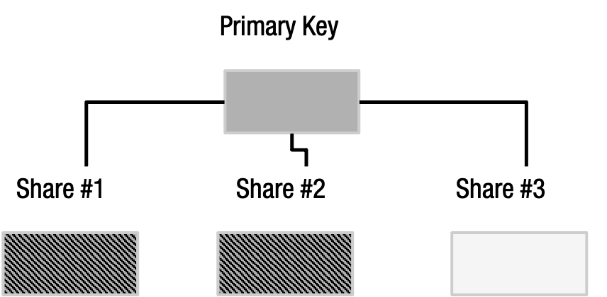

# Securing private keys with Shamir’s Secret Sharing scheme

## How to share a secret?

In cryptography, secret sharing is a way to securely assign fragments of private information amongst a distributed network. Private information, known as a ‘secret’, is split into smaller parts called shares and distributed amongst a group. Each share is useless on its own, but when all the shares come together, they reconstruct the original secret.

This makes secret sharing particularly useful for safeguarding highly sensitive information such as private keys. Instead of storing a private key on a centralised server, a key can be split into shares and dispersed amongst the chosen group of people.

However, one of the main challenges when splitting a key is that distributed shares can often be lost or compromised. When someone finds the backup—written down on paper, a steel plate or any other material—they find the key. Even if only one peice of a multi-part key is found, the finder will have information about the key that may increase their chances of obtaining its other parts. Shares can be stolen. One shareholder may wield the power of their share against their fellow shareholders. And with several distributed shares, it may be impractical to require all shares to reconstruct the original secret.

RIDDLE&CODE uses Shamir’s Secret Sharing scheme to circumvent these limitations and allow customers to backup keys in a more secure and flexible way.

Shamir’s Secret Sharing (SSS) is an algorithm formulated by a renowned Israeli cryptographer Adi Shamir in 1979. SSS allows multiple parties who don’t know or trust each other to store and safeguard private and sensitive information, making them resistant to accidental data loss and malicious attacks (both internal and external).

## Backing up a key

According to the agreement among participants, the private key is split into shares and distributed among an authorised quorum of the key ceremony participants.

Every Shamir sharing scheme has a total number of shares and a threshold. Each share represents a sequence of 33 English words. The threshold is the minimum number of shares necessary to reconstruct the secret. For instance, with five shares and a threshold of three, you only need three of the five shares to reconstruct the original secret.

Any of the unique shares can be used to recover a wallet as long as it fulfils the threshold requirement. There is a minimum threshold limit of two shares, and it is not possible to set the threshold to a single share. The order of shares is not important; however, if there is anything less than the defined threshold, the key can’t be reconstructed.

Shareholders never know how many other encrypted shares are in a secret. If a shareholder dies or loses their share, the other members can still reconstruct the key.

RIDDLE&CODE offers two ways to use Shamir’s Secret Sharing to split a private key: **Shamir Basic** and **Shamir Group**.

### Shamir Basic

Shamir Basic lets you generate up to 16 recovery shares—as a sequence of 33 words—together with a flexible threshold implementation that dictates how many shares are required to restore the key.

### Shamir group

Unlike Shamir Basic, Shamir Group sets a threshold for groups, where each group can be divided into another 16 shares. Each group has its own individual member threshold.

! [Shamir Group](./assets/shamir-group.png)

### BIP-39 backup vs Shamir’s algorithm

|                   | BIP-39       | Shamir's algorithm |
|-------------------|-------------- |--------------------|
| Available shares  | 1              | 1-16 or 1-16 x 1-16|  
| Available threshold|1              | 2-maximum number of shares created.|
| Phrase length     |12, 18, or 24 words|33 words|
| Word order        |The word order is important.|The word order doesn't affect key recovery.|
| Wordlist          |BIP-39          |SLIP-39               |
| Operational complexity| Simple               |Medium/high complexity |

## Disaster recovery

The Token Management Platform provides business continuity by ensuring that even in the case of a disaster scenario (e.g., bankruptcy or functional failure of RIDDLE&CODE), the keys are always under the complete control of the client. Therefore, even in a worst-case scenario, a secure key recovery process can be performed. The key can be recovered using any hardware or software wallet that supports the SLIP-39 standard developed by SatoshiLabs (e.g., Trezor Model T).