This manual describes operations and actions you can perform with the TMP as an administrator or a trader.

# Getting started

## Register an Approval Device:
As an admin, you can register an Approval Device for a user and add it to the user group:

1. Plug-in the Approval Device to your computer,
2. Visit the **Device Manager** page within the Administration section,
3. Click **ADD NEW DEVICE**,

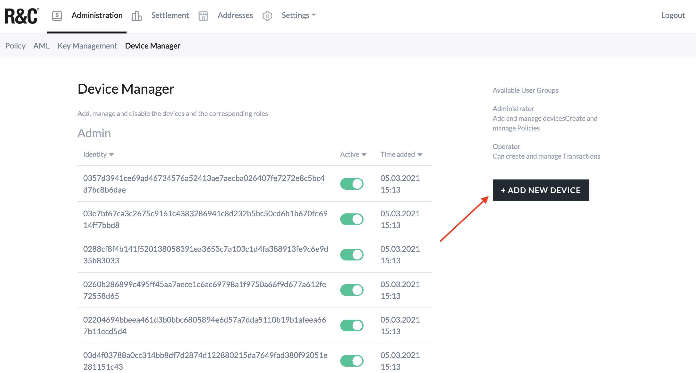

4. Select the user role (admin or trader),

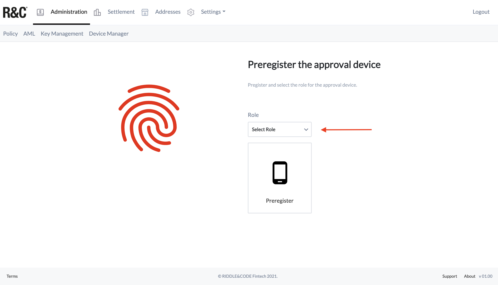

5. Click **Preregister**,
6. Select the wallet and click **Connect**

The device ID (public key) will be displayed on the interface. This ID is now stored in the database and linked with a user. Hand over the device to the onboarded user, who is now able to access the system.

## Sign up
When accessing the TMP interface for the first time you need to Sign up. The process is as follows:

1. Plug-in your Approval Device to the computer,
2. Open the Sign-un page by clicking on the link provided to you by RIDDLE&CODE.
3. Click **Sign up,**
4. Enter the PIN on your device.
5. Choose your Approval Device (wallet) and click **Connect**

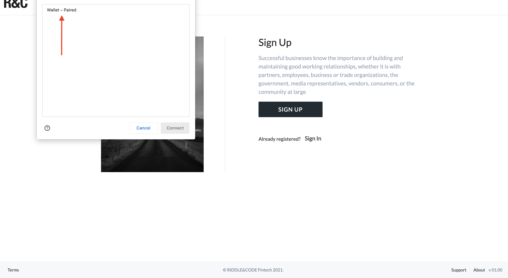

Done! You have successfully signed up for the first time.

## Sign in
To sign in and access the TMP interface:

1. Plug-in your Approval Device to the computer,
2. Click **Sign in**
3. Select your Approval Device and click **Connect**

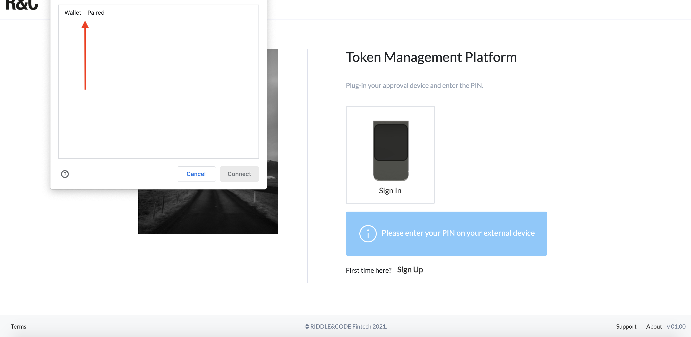

4. Press the check mark on your Approval Device to complete the action.

You have signed up and now you can access the system.

## Change PIN
Your Approval Device is protected with a default PIN, which can be changed to a personalised one.

**NOTE:** For a trader, this is mandatory when logging for the first time.

The steps are as follows:

1. Go to the **Settings** section and click **User**,
2. Click **Change PIN,**

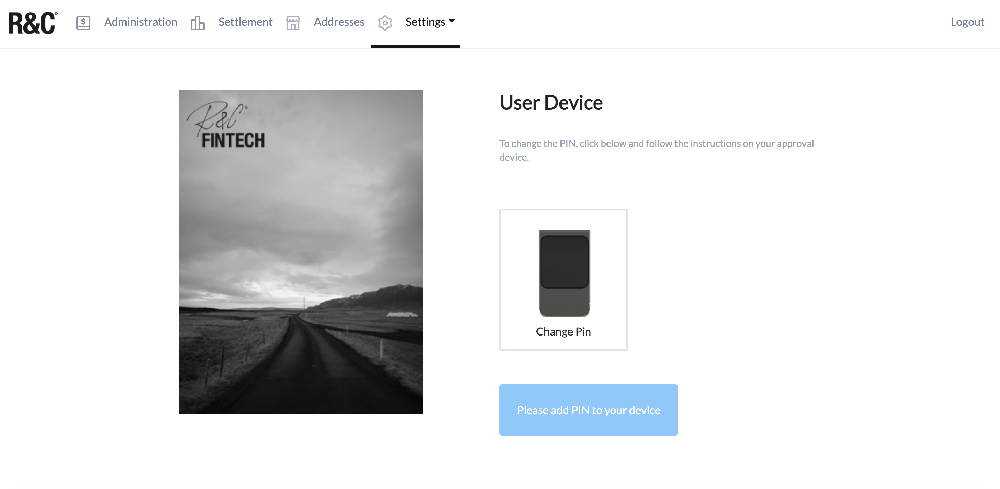

3. Select your Approval Device and click **Connect**
4. Confirm on your device that you want to change the PIN,
5. Enter the current PIN on your device,
6. Now enter the new PIN on your device,
7. Re-enter the new PIN on the device to confirm it.

Next time when you sign in to the TMP, you’ll use your new PIN.

## Manage Coinfirm services

### Become Coinfirm customer

If a client decides to use Coinfirm’s AML service, it will require a paid subscription based on the product pricing. To integrate Coinfirm’s anti-money laundering services, reach out to your point of contact at RIDDLE&CODE. We will guide you through the process.

The steps are as follows:

1. Please reach out to your point of contact at RIDDLE&CODE. We will connect you with the relevant person at Coinfirm and set up a demo. If you decide to use Coinfirm as an AML platform, proceed with the following steps. 
2. You'll receive an invitation e-mail that contains the link to the page to activate your account and create a password.
3. Go to the email received from Coinfirm and click on the activation button.
4. When the account is activated, the AML Platform Dashboard will appear. Take a look around and give it a try.

After you activated your account, you'll receive another e-mail from Coinfirm, with two files attached. One of them is the instruction on how to register and efficiently use the Service Desk, where you can easily report any issues spotted and check the status of tickets reported in the past.

After you successfully register at the Service Desk, you will be able to access instructions to all the tools available on the platform.

### Submit new token

1. Visit the **AML tab**, within the Administration section,

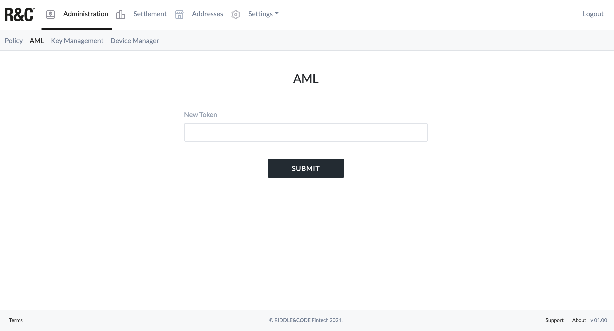

2. Enter the new token,
3. Click **Submit**.

## Manage policies - create a new policy
As an administrator, you can create and add new policies:

1. Visit the Administration section and go to the **Policy** tab,
2. In the right corner, click **NEW POLICY**,

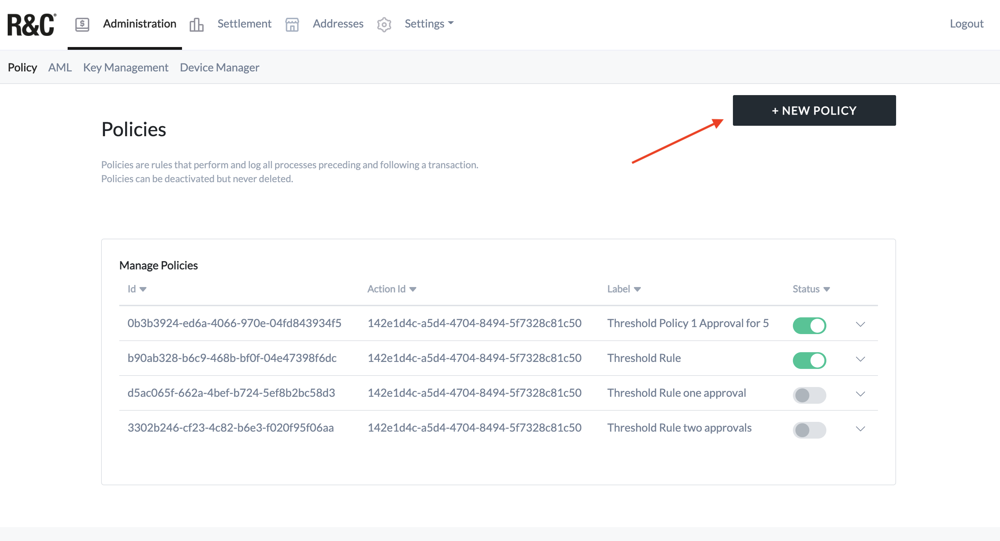

3. Now create the policy's scenario. For example:

*Given the threshold is 0.00011
When the amount of the input is less than the threshold   
Then approve*

4. Click **Submit**.

** View and manage policies **

1. Navigate to the **Policy** tab within the **Administration** section,

There you can see a list of policies that have been created. Each policy is marked with a label, text (description) and current status (active/inactive).

4. To manage policies just click on their **Status** where you can disable/enable them if necessary.

** Disable the existing policy **
As an admin, you can disable the existing policy so that the policy
no longer applies to transaction governance:

1. Navigate to the **Policy** tab, within the **Administration** section,
2. Select **Disable** next to the policy you want to disable,

3. Confirm that you want to update the policy status.

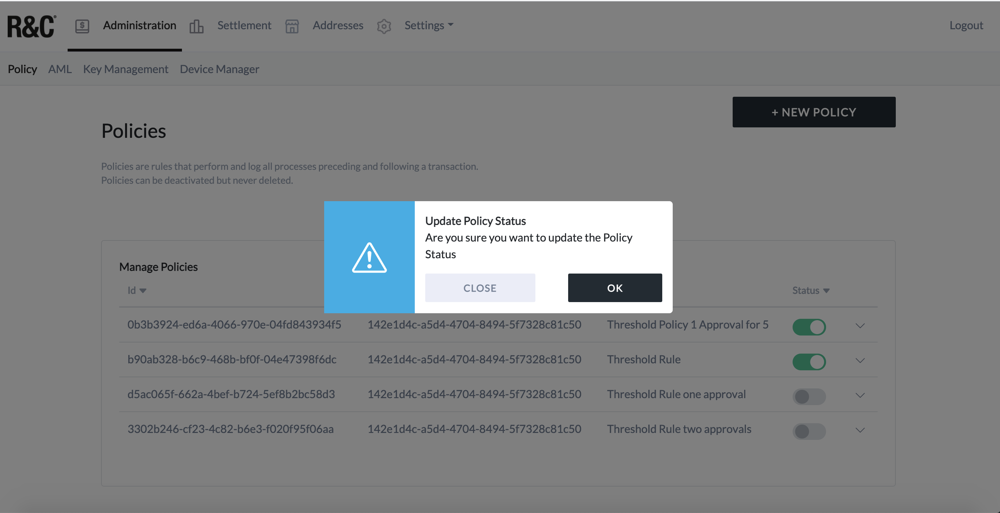

The policy no longer applies.

## Re-enable disabled policy
1. Visit the **Policy tab** within the Administration section,
2. Next to the disabled policy, click **Enable**,
3. Confirm that you want to update the policy status.

The policy is now re-enabled and applies to transaction governance.

## Manage customers' accounts

### Create an account for a new customer
When a new customer is onboarded, an administrator needs to create a new account for the customer. This can be done by adding an internal account or a trusted recipient. The process is as follows:

1. Head over to the **Addresses** section of the interface,
2. Click **NEW ASSET** in the top right corner,

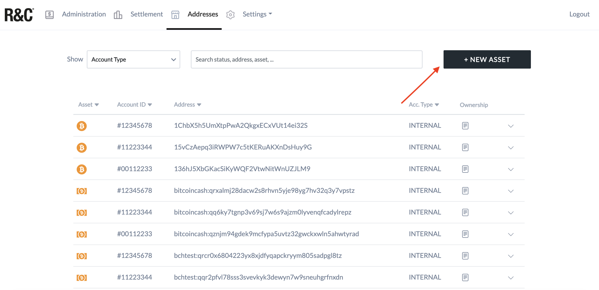

3. On the right side, add account ID to generate address for the customer. You need to prepare a list of unique account IDs that are in a 32bit hexadecimal format. The account ID serves as the derivation index.

4. Click **Generate**
5. On the left side, enter an Account ID,
6. Choose a currency,
7. Enter a coin address and click **Add**.

### View accounts
To view all the accounts within the system, select the **Addresses** section in the top main menu. There you can see the list of all accounts. You can sort them by clicking on the header of the preferred column.
Please note that only one column can be sorted at a time.

* Asset: The currency of the account
* Account ID: The 8 digit hexadecimal identifier of the account
* Address: The actual address of the account
* Acc. typ: Account type

### View the risk level of a coin address

The risk level is a value between 0 and 100, where 0 is low and 100 is high.

To view the risk level of a coin address:
1. Visit the **Addresses** section,
2. Click on the dropdown menu next to the address whose risk level you want to check,
3. Click the **AML Risk Report** link.

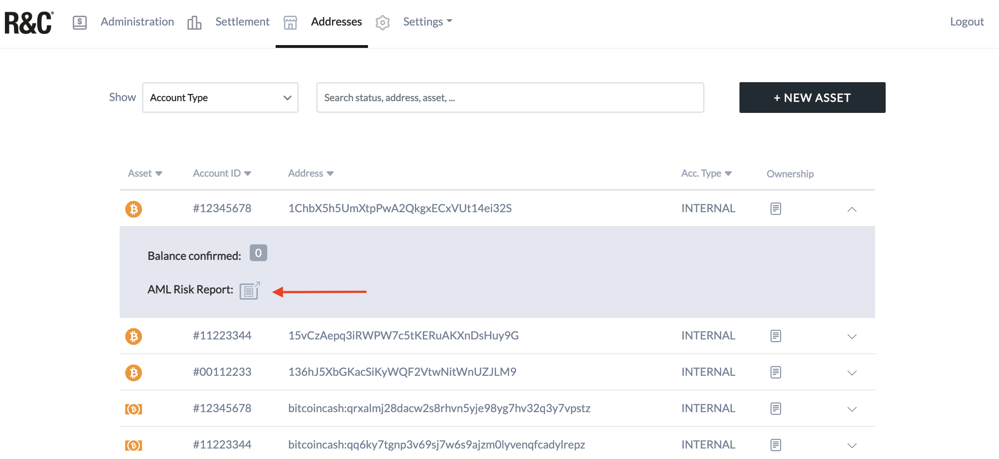

You'll be taken to the Coinfirm website where you can see the address' risk level.

## Manage transactions

### Create transaction request
As a trader, you can create the transaction request and transfer funds from one coin address to another.
Depending on the transaction amount, several traders may need to approve the request.

The process is as follows:
1. Visit the **Settlement** section,
2. Click **NEW TRANSACTION** in the top right corner,

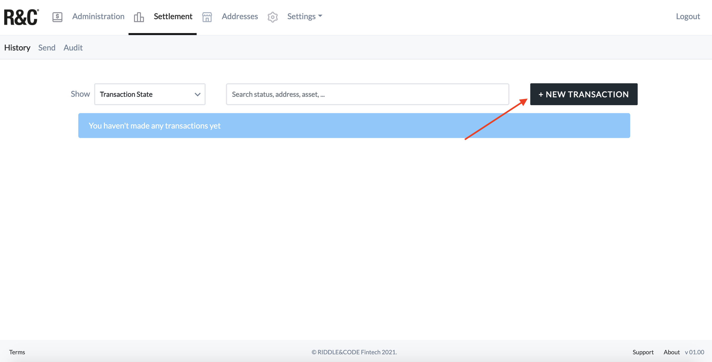

3. Select a currency that you want to transfer,
4. Select the sender’s account (risk value will be displayed),
5. Select the receiver’s account (risk value will be displayed),
6. Choose fees,
7. Enter the amount you want to transfer,
8. Click **Send**.

You submitted the transaction request, which now can be approved or rejected.

### View transaction history
1. Navigate to the **History** page within the **Settlement** section,

Here you will be able to see the list of all past transactions involving account addresses.
