## Register an Approval Device:
To unlock the settings page and functionalities of the system, you need to register and activate the Approval Device you got from RIDDLE&CODE:  

1. Plugin the Approval Device to your computer,
2. Visit the **New Device** page within the Administration section,
3. Click **Register**,
4. Select the device on the interface,
5. Select the user role,
6. Click **Register Device,**
7. The device ID (public key) will be displayed on the interface. This ID is now stored in the database and linked with a user (Trader/Viewer)

**NOTE:** You must activate five devices per hour.

## Register Approval Device for a user

1. As an admin, you can register an Approval Device for a user and add it to the user group:
2. Plugin the device you want to register to your computer,
3. Visit the dedicated page: https://cs-beta.r3c.network/register-device,
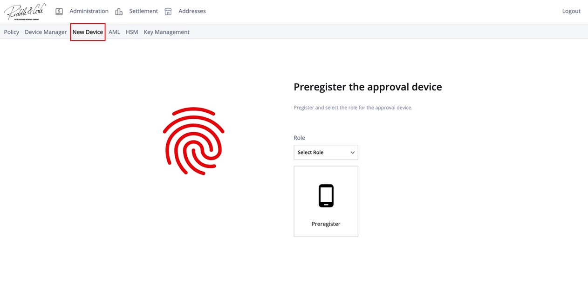
4. Click Pre-register,
5. Enter the PIN on the device and click **Preregister,**
6. Hand over the device to the onboarded user, who is now able to access the system.

## Sign up
Access to the web interface is granted to pre-registered devices only. To access the web interface for the first time:

1. Plugin your Approval Device to the computer,
2. Open the Sign-in page by clicking on the link: https://cs-beta.r3c.network/,
3. Click **Sign up,**
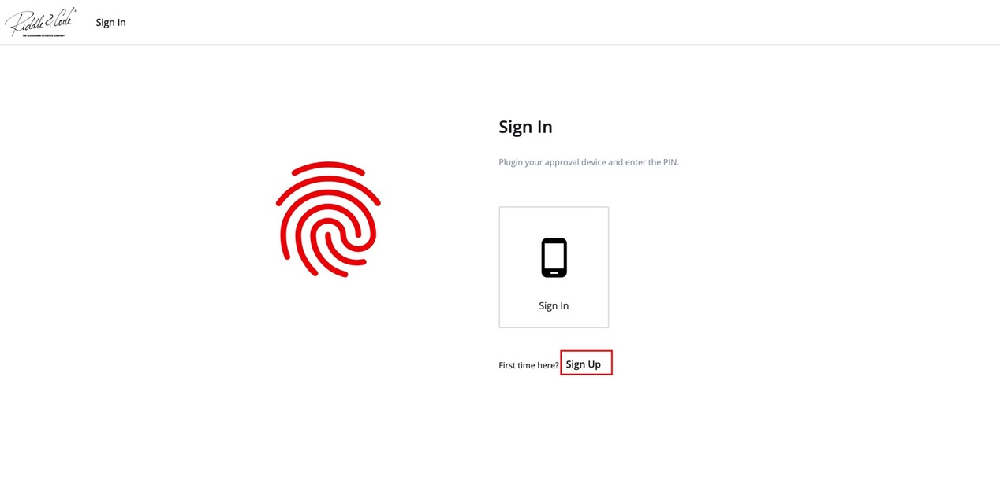
4. Click **Sign up** again,
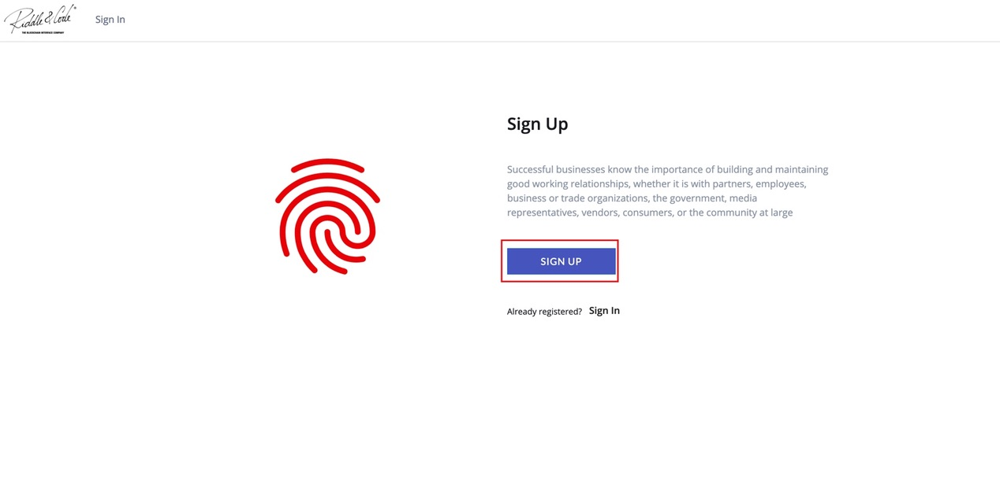
5. Enter your PIN on the device.

## Sign in
Access to the web interface is granted to pre-registered devices only. To access the web interface:

1. Plugin your Approval Device to the computer,
2. Open the Sign-in page by clicking on the link: https://cs-beta.r3c.network/signin,
3. Click **Sign in,**
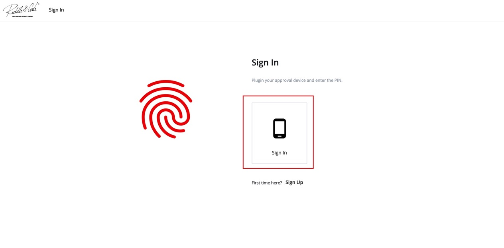
4. Enter your PIN on the device.

## Change PIN
To access the web interface, you need to unlock your Approval Device. 
The device is protected with a default PIN, which can be changed to a personalised one.

**NOTE:** For a trader, this is mandatory when logging for the first time.

The steps are as follows:

1. Go to the **Device Manager** tab, within the Administration section,
2. Click **Change PIN,**
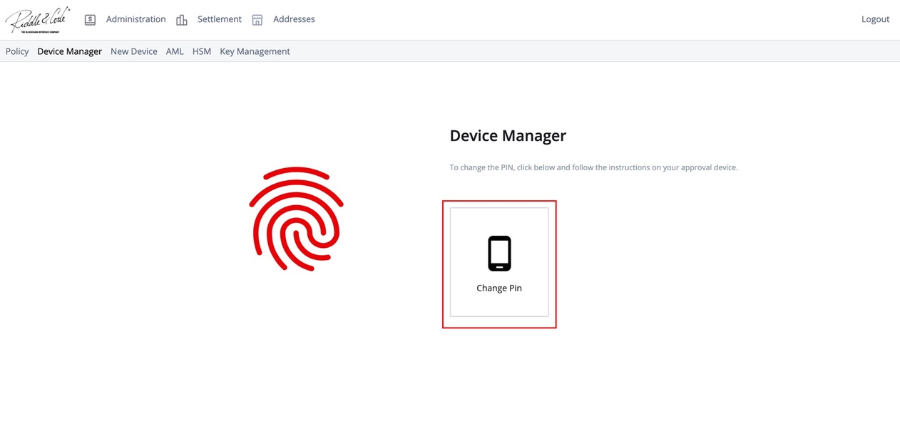
3. Enter the current PIN on your device,
4. Now enter the new PIN on your device,
5. Re-enter the new PIN on the device to confirm it,
6. Next time when you sign in, you’ll use your new PIN.

# Coinfirm AML Service
## Set Coinfirm credentials

To use AML Coinfirm services, you need to set your credentials.

**NOTE:** Please bear in mind that you need to have a running subscription at Coinfirm to perform the following step:

1. Visit the **AML tab**, within the Administration section,
2. Add username,
3. Add password,
4. Click **Save.**

# Manage policies
## Create a new policy
As an administrator, you can create and add new policies:

1. Visit the Administration section and go to the **Policy tab**,
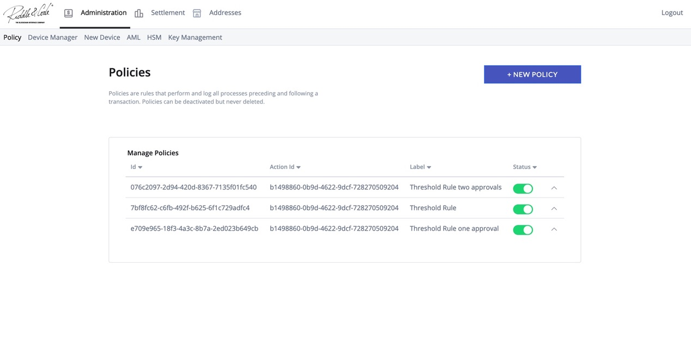
2. In the right corner, click New Policy. Now create the policy's scenario. For example:
Given the threshold is 0.00011
When the amount of the input is less than the threshold   
Then approve
3. Click **Create Policy.**

## View and manage policies

1. Navigate to the **Policy tab** within the Administration section,

2. There you can see a list of policies that have been created.
3. Each policy is marked with a label, text (description) and current status (active/inactive).
4. These policies can be disabled/enabled if necessary.

## Disable the existing policy
As an admin, you can disable the existing policy so that the policy
no longer applies to transaction governance:

1. Navigate to the **Policy tab**, within the Administration section,

2. Select **Disable** next to the policy you disable,
3. The policy no longer applies.

## Re-enable disabled policy
1. Visit the **Policy tab** within the Administration section,

2. Next to the disabled policy, press **Enable,**
3. The policy is now re-enabled and applies to transaction governance.

# Manage Securosys HSM keys
## Create Securosys HSM key
As an administrator, you can set up and add Securosys HSM keys:
1. Navigate to Securosys HSM Configuration by selecting the **HSM tab** within the Administration section,
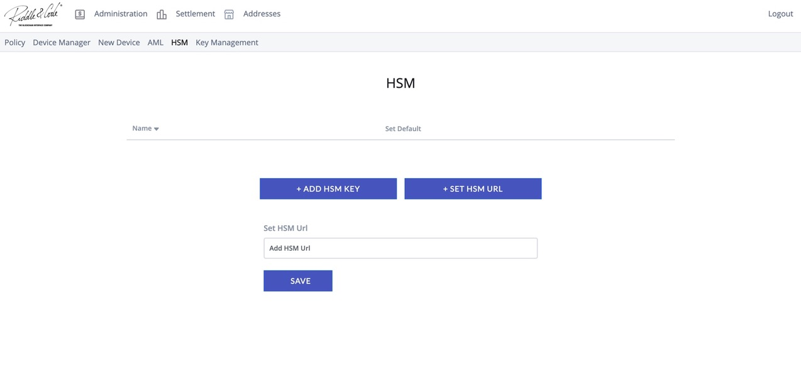
2. Click **Add HSM Key,**
3. Enter the HSM Key ID.

## View Securosys HSM keys
1. Visit the **HSM tab** within the Administration section and navigate to Securosys Configuration Screen,
2. There you can see a list of all HSM keys.

## Set default Securosys HSM key for curve
1. Select the **HSM tab** within the Administration section and navigate to Securosys HSM Configuration. There you can see a list of all HSM keys,
2. Click **Set** for HSM keys that you want to be set as default.

## Update Securosys HSM URL
As an administrator, you can update Securosys HSM keys by entering the new URL:
1. Navigate to Securosys HSM configuration,
2. Click Set HSM URL,
3. Enter the HSM URL.

# Manage accounts
## Create an account for a new customer
When a new customer is onboarded, the admin needs to create a new account. This can be done by adding an internal account or a trusted recipient. The process is as follows: 

1. Head over to the **Addresses section** of the web interface,
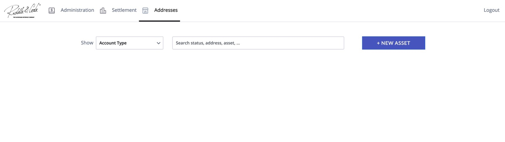
2. Click **New Asset** in the top right corner,
3. Choose to add a new account,
4. Choose whether you want to create an internal account or add a trusted recipient,

5. Enter the valid address.

## Create an internal account
To add an internal account, the admin needs to perform the following steps:

1. Sign in to the system as an **Admin,**
2. Head over to the **Addresses section** of the web interface,

3. Click **New Asset** in the top right corner,
4. You need to prepare a list of unique account IDs that are in a 32bit hexadecimal format. The account ID serves as the derivation index,
5. Enter the values on the right side,
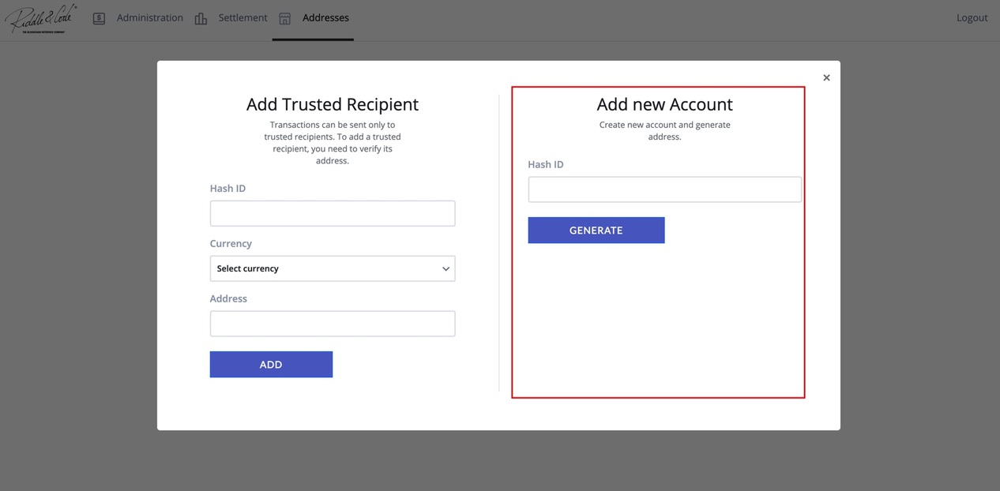
6. Enter the Hash ID,
7. Click **Generate.**

## Add trusted recipient
To enable traders to send funds to the external addresses,
an admin needs to create the appropriate label and add trusted recipients.
The steps are as follows:

1. Sign in to the system as an **Admin,**
2. Head over to the **Addresses section** of the web interface,

3. Click **New Asset** in the top right corner,
4. Enter the values on the left side,
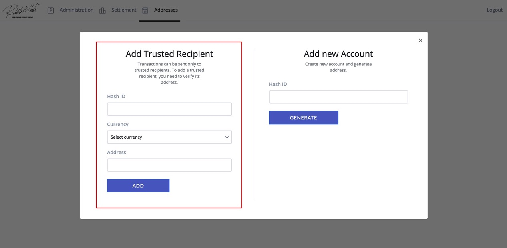
5. Enter a Hash ID,
6. Choose a currency,
7. Enter a coin address and click **Add.**

## View accounts
To view all the accounts within the system, select the **Addresses section** in the top main menu. 

The table can be sorted by clicking on the header of the preferred column. 
Please note that only one column can be sorted at a time.

* Asset: The currency of the account
* Account ID: The hash ID of the account
* Address: The actual address of the account
* Acc. typ: Account type

## View trusted recipients

1. Visit the **Addresses section,**
2. Select Trusted Recipients via the dropdown filter,
3. Now you will be able to see a table that contains the list of all trusted recipients.

## View the risk level of a coin address

The risk level is a value between 0 and 100, where 0 is low and 100 is high. 
To view the risk level of a coin address:
1. Visit the **Addresses section,**
2. There you will be able to see all loaded addresses in a table and check their risk level.

# Manage transactions
## Create Transaction Request 
As a trader, you can create the Transaction Request and transfer funds from one coin address to another. 
Depending on the transaction amount, several traders may need to approve the request. 
The process is as follows:

1. Visit the **Send tab** within the Settlement section,
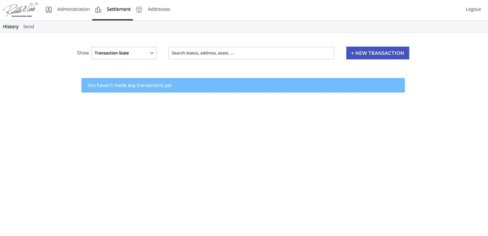
2. Click **New Transaction** in the top right corner
3. Select a currency that you want to transfer,
4. Select the sender’s account (risk value will be displayed),
5. Select the receiver’s account (risk value will be displayed),
6. Choose fees,
7. Enter the amount you want to transfer,
8. Click **Send.**

You submitted the Transaction Request, which now can be approved or rejected.

## View transaction history
1. Navigate to the **History** page within the Settlement section,
2. Now you will be able to see the list of all past transactions involving account addresses.

