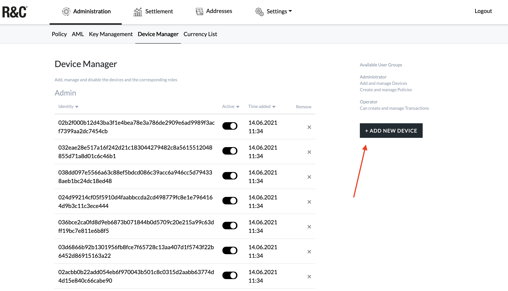
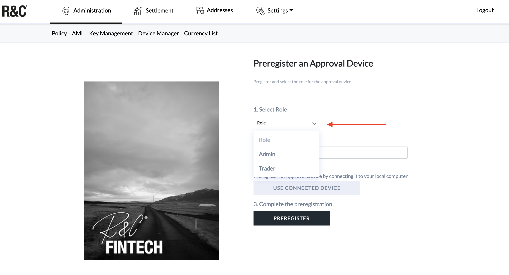
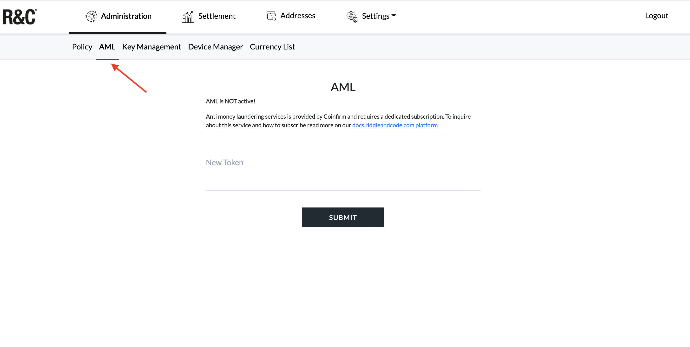
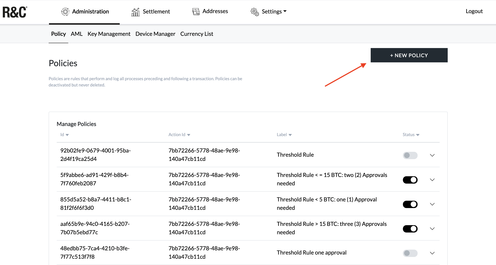
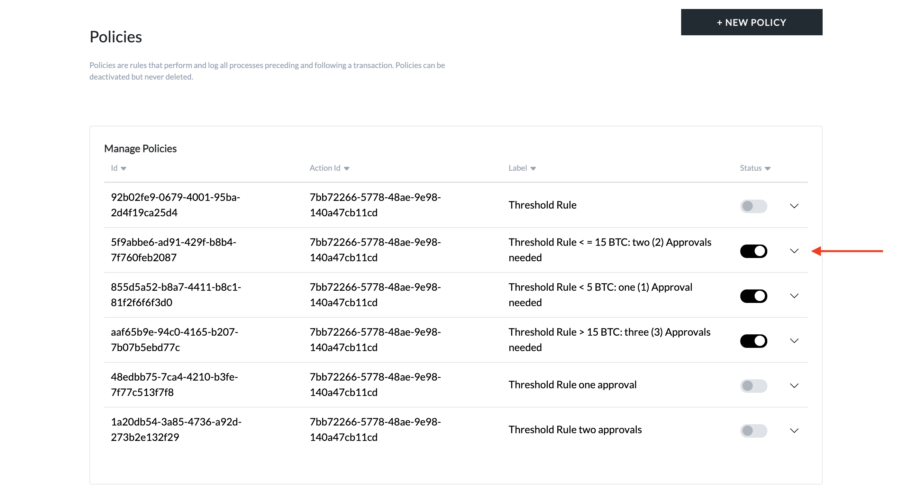
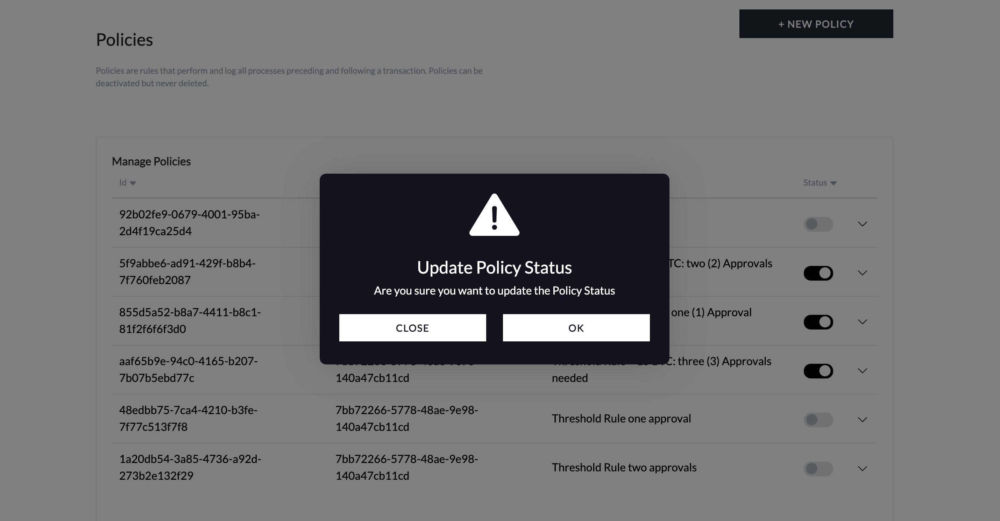

# Getting started guide for administrators

This manual describes operations that you can perform with the TMP as an administrator.

## Note: Reference System

RIDDLE&CODEs Token Management Platform enables the best user experience on the following reference system:

` Windows 10 pro, OS build 19041.985 in combination with Chrome Version 91.0.4472.77 `

Other operating systems and browser configurations are untested and officially not recommended. Please reach out to your single point of contact at RIDDLE&CODE for any inquiries about other system and browser configurations.

## Register an Approval Device:
As an admin, you can register an Approval Device for a user and add it to the user group:

<figure class="video_container">
 <iframe src="https://player.vimeo.com/video/592134892?h=43b79380e5" width="640" height="366" frameborder="0" allow="autoplay; fullscreen; picture-in-picture" allowfullscreen></iframe>
</figure>

### How too add a new device

1. Plug-in the Approval Device to your computer.
2. Visit the *Device Manager* page within the Administration section.
3. Click **ADD NEW DEVICE**.

5. Select the user role (admin or trader).

6. Add **Approval Device ID**.

7. Click **Preregister**.
8. Select the wallet and click **Connect**.

The device ID (public key) will be displayed on the interface. This ID is now stored in the database and linked with a user. Hand over the device to a user, who is now able to access the system.

## Sign up
When accessing the TMP interface for the first time you need to sign up. The process is as follows:

1. Plug-in your Approval Device to the computer.
2. Open the *Sign up* page by clicking on the link provided to you by RIDDLE&CODE (e.g., customer-tmp.r3c.network).
3. Click **Sign up**.
4. Enter the PIN on your device.
5. Choose your Approval Device (wallet) and click **Connect**.

You have successfully signed up.

## Sign in
To sign in and access the TMP interface:

1. Plug-in your Approval Device to the computer.
2. Click **Sign in**.
3. Select your Approval Device and click **Connect**.
4. Press the check mark on your Approval Device to complete the action.

You have successfully signed in.

## Change PIN
Your Approval Device is protected with a default PIN, which can be changed to a personalised one.
The steps are as follows:

1. Go to *Settings* and in the dropdown menu click **User**.
2. Click **Change PIN**.

3. Select your Approval Device and click **Connect**.
4. Confirm on your device that you want to change the PIN.
5. Enter the current PIN on your device.
6. Now enter the new PIN on your device.
7. Re-enter the new PIN on the device to confirm it.

Next time when you sign in to the TMP, you’ll use your new PIN.

## Manage Coinfirm services

### Become Coinfirm customer

If a client decides to use Coinfirm’s AML service, it will require a paid subscription based on the product pricing. To integrate Coinfirm’s anti-money laundering services, reach out to your point of contact at RIDDLE&CODE. We will guide you through the process.

The steps are as follows:

1. Please reach out to your point of contact at RIDDLE&CODE. We will connect you with the relevant person at Coinfirm and set up a demo. If you decide to use Coinfirm as an AML platform, we will continue the process.
2. You'll receive an invitation e-mail that contains the link to the page to activate your account and create a password.
3. Go to the email received from Coinfirm and click on the activation button.
4. When the account is activated, the AML Platform Dashboard will appear. Take a look around and give it a try.

After you activated your account, you'll receive another e-mail from Coinfirm, with two files attached. One of them is the instruction on how to register and efficiently use the Service Desk, where you can easily report any issues spotted and check the status of tickets reported in the past.

After you successfully register at the Service Desk, you will be able to access instructions to all the tools available on the platform.

### Submit new token

1. Visit the *AML tab*, within the Administration section.

2. Enter the new token.
3. Click **Submit**.

## Manage policies

### Create a new policy

As an administrator, you can create and add new policies:

1. Visit the Administration section and go to *Policy*.
2. In the right corner, click **NEW POLICY**.

3. Create the policy's scenario. For example:

*Given the threshold is 0.00011
When the amount of the input is less than the threshold   
Then approve*

4. Click **Submit**.

Below you will find an How to guide that reflects the above steps: 

To be added How to Add a Policy Video

### View and manage policies

1. Navigate to *Policy* within the **Administration** section,

There you can see a list of policies that have been created. Each policy is marked with a label, text (description) and current status (active/inactive).

4. To manage policies just click on their *Status* where you can disable/enable them if necessary.

### Disable the existing policy
As an admin, you can disable the existing policy so that the policy
no longer applies to transaction governance:

1. Navigate to *Policy*.
2. Select **Disable** next to the policy you want to disable.

3. Confirm that you want to update the policy status.

The policy no longer applies.

### Re-enable disabled policy
1. Visit *Policy*.
2. Next to the disabled policy, click **Enable**.
3. Confirm that you want to update the policy status.

The policy is now re-enabled and applies to transaction governance.

## How to recompute new addresses

When new digital assets are added to the Platform Administrators need to issue new addresses for the existing AccountIDs. This operation creates the correct address typ following the known segregated account process. 

** Please note: performing this operation multiple times will not result in additional coin addresses of existing currencies **

<figure class="video_container">
 <iframe src="https://player.vimeo.com/video/600982908?h=b9f46e7fdb" width="640" height="366" frameborder="0" allow="autoplay; fullscreen; picture-in-picture" allowfullscreen></iframe>
</figure>

1. Visit *Currency List*.
2. Push the button "recompute all addresess".
3. Wait until success message appears.

All of the exsisting Account ID's have been updated with addresses for the new currencies.

