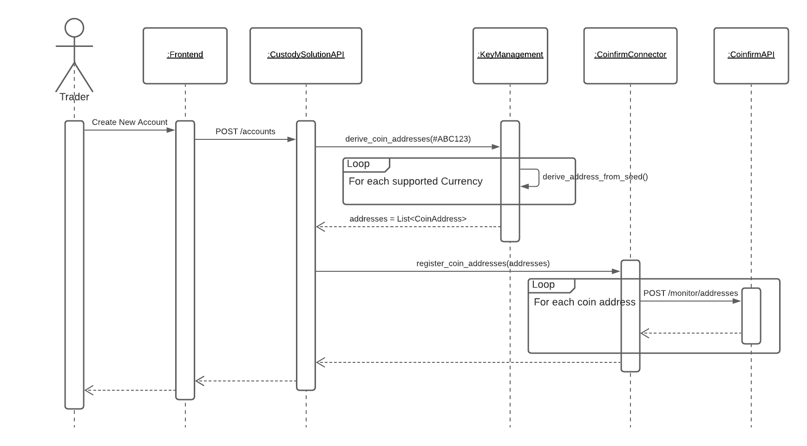

# Integrating Coinfirm's AML/KYC services

### **Creating an account and registering coin addresses**&#x20;

.png>)

To create a new account, the user needs to enter a 32bit integer in hexadecimal format into the frontend. A request will be sent to RIDDLE\&CODE’ platform that will derive, based on the provided number and a derivation seed, coin addresses for each supported currency. The derived addresses will be sent to CoinfirmConnector, which handles the interaction with the services supported by Coinfirm. Each coin address will be registered to the monitoring system of Coinfirm.

#### **Adding of trusted recipients**

The user provides an account ID in the 32bit integer hexadecimal format and a coin address. If there is no account with the provided account ID, the system will generate a new account and add the provided coin address. The coin address will be sent to CoinfirmConnector and further to the services of Coinfirm where it is added to the monitoring system.\

#### **Creating a transaction and retrieving risk levels**

In order to create a transaction, the user has to visit the sign transaction page and enter the IDs of the accounts to be used in the transaction. Based on the currency and the ID of an account, the associated coin address will be retrieved. The coin address is then sent to the CoinfirmConnector, which uses the Coinfirm API to retrieve the latest risk level. The risk level will be shown to the user as a number between 0 and 100, where 0 means low risk and 100 means high risk.

This flow is done for the sender as well as for the receiver account. Based on this information, the user can decide if a transaction should be signed or not.

### **Integrated Coinfirm API endpoints**

A detailed API description can be found under the following links:

* For the authentication to the API, the following bearer tokens are used: [https://app.swaggerhub.com/apis/Coinfirm-swagger/API/3.0.4#/](https://app.swaggerhub.com/apis/Coinfirm-swagger/API/3.0.4#/)
* To authenticate to the API and to retrieve a bearer token, please visit the following link: [https://app.swaggerhub.com/apis/Coinfirm-swagger/API/3.0.4#/Auth/post\_auth\_login](https://app.swaggerhub.com/apis/Coinfirm-swagger/API/3.0.4#/Auth/post\_auth\_login)
* To get the latest information about a registered coin address, please visit the following link: [https://app.swaggerhub.com/apis/Coinfirm-swagger/API/3.0.4#/Monitoring](https://app.swaggerhub.com/apis/Coinfirm-swagger/API/3.0.4#/Monitoring) panel/post\_panels\_monitoring\_wallet\_addresses

\
