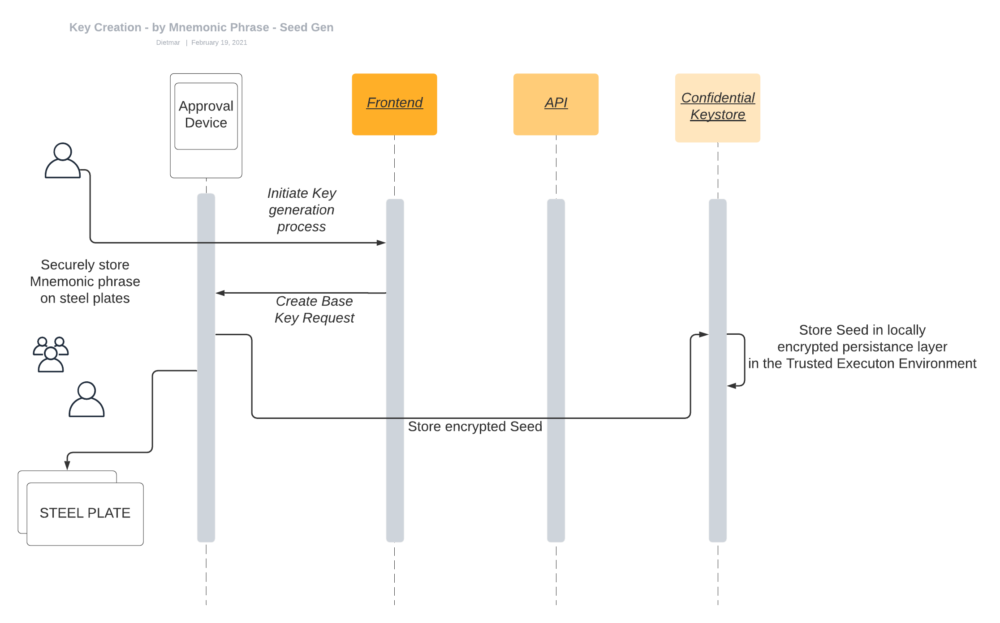

# Key generation, backup and recovery

Key management covers all aspects of generating, securing, exchanging/trading and revoking keys. Since keys, private and public, act as a representation of indisputable identities, ownership of assets and proof-of-origin, a tokenization platform needs to provide all aspects to:

* create keys in a secure and agile way
* manage keys and related processes within a trusted and confidential environment
* perform value or metadata transactions in a manner that meets the throughput and frequency requirements of mature industries
* enable revocation/withdrawal and re-creation of keys in the framework of key restoring and disaster management.

### Generating keys

Key generation is performed in a secure and agile way with no possibility for others to intercept or access the keys.

The keys are generated within a dedicated Approval Device and exported to the Confidential Keystore via hardened, secure communication channels. A master key is then generated within the Trusted Execution Environment (TEE), which ensures the encryption of data in transit, while being processed and at rest.&#x20;

Additional addresses are derived from the master key within the TEE. Following key generation, the key derivation path is defined according to the BIP-32, BIP-39, BIP-44 and additional applicable cryptocurrency standards. The BIP-32 protocol can turn the seed into a so-called mnemonic phrase that can be backed up according to a disaster recovery process.

#### Security measures during the key generation&#x20;

The following safety and control measures are in place during the key generation process:&#x20;

1. Trusted Execution Environment ensures encryption of data in transit, while being processed and at rest.
2. Decentralised attestation enclaves and identities support a hardened authenticity and integrity verification process.
3. Secure and confidential execution within untrusted environments (RIDDLE\&CODE cannot access sensitive, confidential or encrypted data).
4. Audit logs are created for all transactions and changes. Due to the integrity and authenticity of the platform, it can be guaranteed that these events are always recorded in a federated audit ledger.
5. Hardened communication systems.

### Key backup and verification

After the key is generated, the backup mnemonic phrase is disclosed to an administrator on the Approval Device that has been used to issue the seed.&#x20;

The mnemonic phrase consists of twenty-four words and is crucial to the backup and disaster recovery process. It is used to restore keys in the case of loss or when a new initialisation of wallets is required. Due to its critical role in key management, the secret has to be safeguarded from malicious users. RIDDLE\&CODE’s recommendation is to store it in an off-premise vault.&#x20;

**NOTE:** The backup of the mnemonic phrase is available only once, during the key ceremony. The mnemonic phrase cannot be retrieved later.

Once the mnemonic phrase is safely backed up, it is time to perform the verification of the process. This allows clients to verify the integrity of the mnemonic phrase and ensures that the keys being created by this mnemonic phrase equal the keys that are already in the system.

The backup process is done during the key ceremony:

1. User verifies the parts of the mnemonic phrase on the Approval Device.
2. The process continues until the phrase is verified.

If the verification is successful, the backup mnemonic phrase can be trusted.&#x20;

### **Key recovery**&#x20;

Token Management Platform provides business continuity by ensuring that even in the case of a disaster scenario, such as bankruptcy or functional failure of RIDDLE\&CODE, keys remain under full control of the client and can be recovered.

Key recovery can be triggered via the user interface, where the user will be led through the entire process, step-by-step:

1. The administrator starts the process by accessing the web interface and navigating to the **Key Management** section.
2. The administrator connects the Approval Device to the computer, unlocks it with PIN and clicks **Continue.**
3. All parties follow the onscreen guidance to enter the mnemonic phrase and complete the process.

When the process is completed, and address generation and transaction signing capabilities per client are available.

