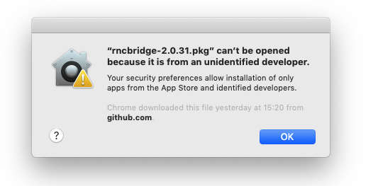
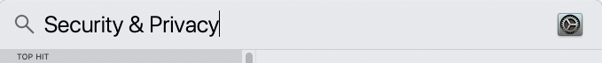
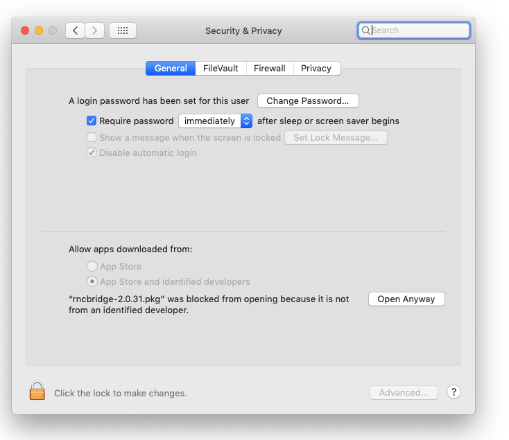
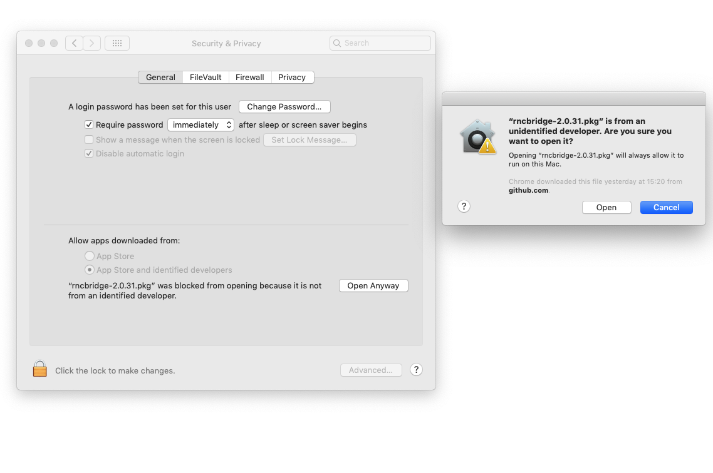
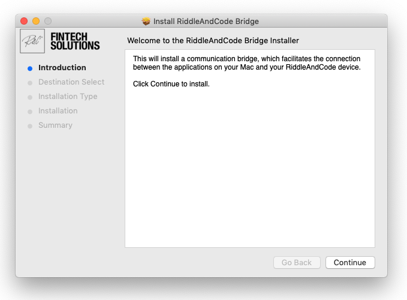
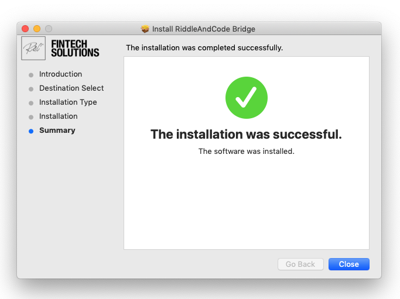

# FAQs

Which operating systems are compatible with the TMP?

Token Management Platform enables the best user experience on the following reference system:

**Windows 10 pro, OS build 19041.985 in combination with Chrome Version 91.0.4472.77**

Other operating systems and browser configurations are untested and not recommended. Please reach out to your single point of contact at RIDDLE\&CODE for any inquiries about other system and browser configurations.

My device is connected, but it doesn't seem to be paired. How can I fix this?

First, make sure that you Approval Device is unlocked. Then, close and reopen the TMP browser window. That should fix the issue.

My device is paired and unlocked, but I still can't sign in. How can I fix this?

In this case, perform the following steps:

1. Unplug your Approval Device,
2. Clear Chrome cache,
3. Plug in and unlock your device,
4. Now try to sign in again.

ex

Which assets are currently supported?

For a complete list of the available currencies please refer to [Available currencies](available-currencies.md)

What are AccountIDs ?

AccountIDs provide a set of coin addresses under a common identifier. New internal coin addresses are generated by adding a new AccountID. The system then uses the AccountID to create a set of coin addresses for all supported currencies.

Hardened derivation paths are used so that the valid range for AccountIDs is defined from 0x0000 0000 to 0x7FFF FFFF.

**Note:** any AccountID must start with the # sign. For example:

* `#00112233`
* `#11223344`
* `#00DDEEFF`

The Approval device can't be found and I'm using MacOs. Do I need to install any additional applications to access and use the TMP?

Yes, you will need to install the RIDDLE\&CODE Bridge Service application.

The steps are as follows:

* Download the RnC Bridge 2.0.31. You can find the latest version [here](https://riddlecode.app.box.com/s/ksud48m25jytzhrhcg81hay9c378jp0y).
* Next, run "rncbridge-2.0.31.pkg". You'll see that **Security and Privacy Centre** will block the action. This means that you have to save the app as an exception to the security settings.

* To save the app as an exception to the security settings, follow the steps below.
* Open the **Security and Privacy** service on your MacBook.

* Navigate to _Allow apps downloaded from_

* Click **Open Anyway** and then confirm that you want to open the app.

* Start the installation process and follow the steps on the screen.

After the app is successfully installed, you are ready to access and use the Token Management Platform.


#### Couldn't find the answer? Please reach out to us at support@riddleandcode.com


