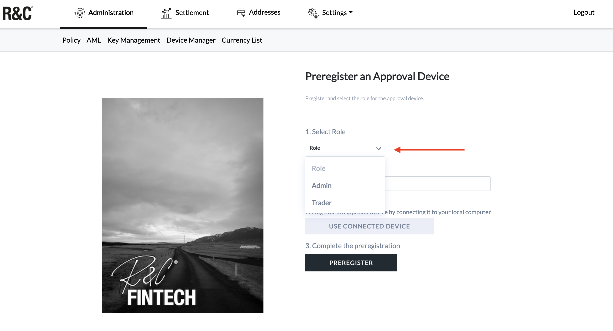
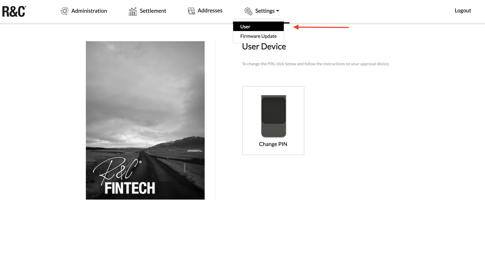
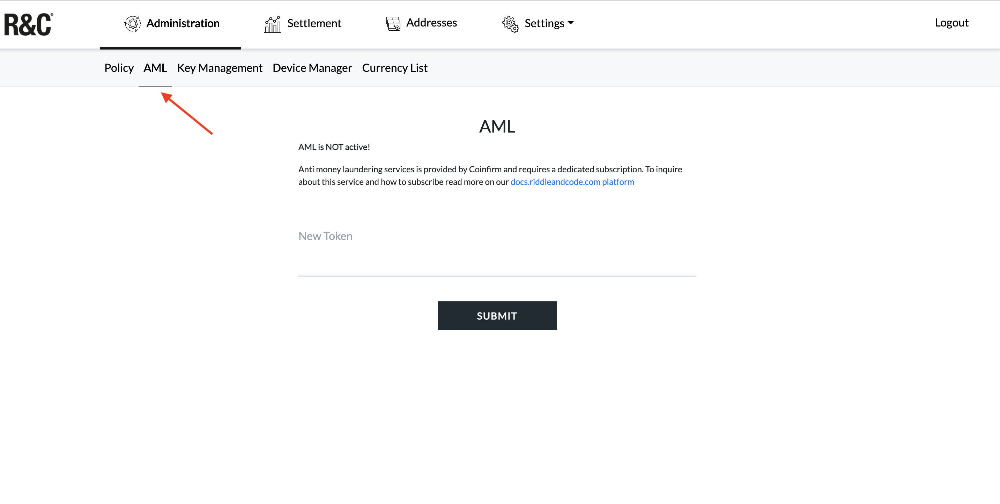
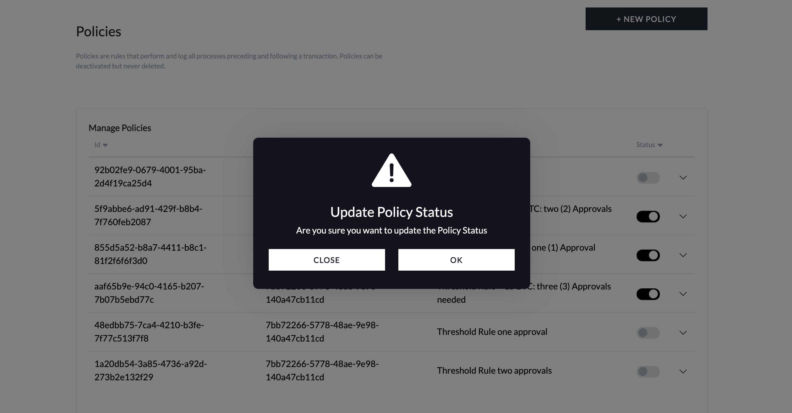

# Getting started guide for administrators

### Note: Reference System

Token Management Platform enables the best user experience on the following reference system:

`Windows 10 pro, OS build 19041.985 in combination with Chrome Version 91.0.4472.77`

Other operating systems and browser configurations are untested and not recommended. Please reach out to your single point of contact at RIDDLE\&CODE for any inquiries about other system and browser configurations.

### Register Approval Device

As an admin, you can register an Approval Device for a user and add it to the user group:



#### To add a new device:

* Plug-in the Approval Device to your computer,
* Visit the _Device Manager_ page within **Administration,**
* Click **ADD NEW DEVICE,**

* Select the user role (admin or trader),

* Add **Approval Device ID,**
* Click **Preregister,**
* Select the wallet and click **Connect**.

Device ID (public key) will be displayed on the interface. This ID is now stored in the database and linked with a user. Hand over the device to the user, who is now able to access the system.

### Sign up

When accessing the TMP interface for the first time, you need to sign up. The process is as follows:

* Plug-in your Approval Device to the computer,
* Open the _Sign up_ page by clicking on the link provided to you by RIDDLE\&CODE (e.g., customer-tmp.r3c.network),
* Click **Sign up,**
* Enter the PIN on your device,
* Choose your Approval Device (wallet) and click **Connect.**

You have successfully signed up.

### Sign in

To sign in and access the TMP interface:

* Plug-in your Approval Device to the computer,
* Click **Sign in,**
* Select your Approval Device and click **Connect,**
* Press the check mark on your Approval Device to complete the action.

You have successfully signed in.

### Change PIN

Your Approval Device is protected with a default PIN that can be changed to a personalised one. The steps are as follows:

* Go to _Settings_ and in the dropdown menu click **User,**
* Click **Change PIN,**

* Select your Approval Device and click **Connect,**
* Confirm on your device that you want to change the PIN,
* Enter the current PIN on your device,
* Now enter the new PIN on your device,
* Re-enter the new PIN on the device to confirm it.

Next time when you sign in to the TMP, you’ll use your new PIN.

### Manage Coinfirm AML services

#### Become Coinfirm customer

If a client decides to use Coinfirm’s AML service, it will require a paid subscription based on the product pricing. To integrate Coinfirm’s anti-money laundering services, reach out to your point of contact at RIDDLE\&CODE. We will guide you through the process.

The steps are as follows:

* Please reach out to your point of contact at RIDDLE\&CODE. We will connect you with the relevant person at Coinfirm and set up a demo. If you decide to use Coinfirm as an AML platform, we will continue the process.
* You'll receive an invitation e-mail that contains the link to the page to activate your account and create a password.
* Go to the email received from Coinfirm and click on the activation button.
* When the account is activated, the AML Platform Dashboard will appear. Take a look around and give it a try.

After activating your account, you'll receive another e-mail from Coinfirm, with two files attached. One of them is the instruction on how to register and efficiently use the Service Desk, where you can easily report any issues spotted and check the status of tickets reported in the past.

After you successfully register at the Service Desk, you will be able to access instructions to all the tools available on the platform.

#### Submit new token

* Visit the _AML tab_, within the Administration section,

* Enter the new token,
* Click **Submit**.

### Manage policies

#### Create a new policy



As an administrator, you can create and add new policies:

* Visit the Administration section and go to _Policy,_
* In the right corner, click **NEW POLICY,**
* Create scenario for the policy. For example:

_Given the threshold is 0.00011 When the amount of the input is less than the threshold_\
_Then approve_

* Click **Submit**.

#### View and manage policies

* Navigate to _Policy_ within the **Administration** section.

There you can see a list of policies that have been created. Each policy is marked with a label, text (description) and current status (active/inactive).

To manage policies just click on their _Status_ where you can disable/enable them if necessary.

#### Disable the existing policy

As an administrator, you can disable the existing policy so that the policy no longer applies to transaction governance:

* Navigate to _Policy,_
* Select **Disable** next to the policy you want to disable,

* Confirm that you want to update the policy status.

The policy no longer applies.

#### &#x20;Re-enable disabled policy

* Visit _Policy,_
* Next to the disabled policy, click **Enable,**
* Confirm that you want to update the policy status.

The policy is now re-enabled and applies to transaction governance.

### How to recompute new addresses

When new digital assets are added to the platform, administrators need to issue new addresses for the existing **Account IDs**. This operation creates correct address type.

**Please note: performing this operation multiple times will not result in additional coin addresses of existing currencies.**

****



The steps are as follows:

1. Visit _Currency List,_
2. Click **RECOMPUTE ALL ADDRESSES,**
3. Wait until success message appears.

All of the existing Account IDs will be updated with addresses for the new currencies.

****

****

\

\

\
