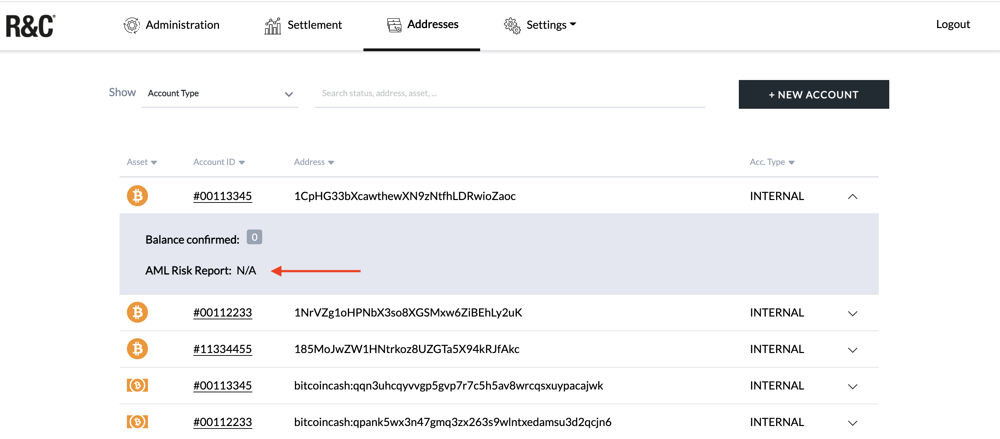

# Getting started guide for traders

TMP uses a role-based access and control (RBAC) system to associate permissions to roles and to specify access rights to the platform and any of its functionalities. This assures that only the user with the appropriate role and credentials can access certain areas of the platform. Roles are divided into two main functions: administrators and traders.

Administrators are the only ones who have access to the Policy Layer and control so-called critical actions—the assignment of roles and responsibilities, access rights to the platform, registering a user, adding new policies, etc.

Traders, or operators, can create transaction requests, approve transactions, add new accounts/addresses and block the transfer of funds to untrusted external accounts.

To access the TMP as a trader, you need an Approval Device and the link (e.g., _customername-tmp.r3c.network_) to the user interface. This link is provided by RIDDLE\&CODE.

### &#x20;Note: Reference System

RIDDLE\&CODEs Token Management Platform enables the best user experience on the following reference system:

`Windows 10 pro, OS build 19041.985 in combination with Chrome Version 91.0.4472.77`

Other operating systems and browser configurations are untested and not recommended. Please reach out to your single point of contact at RIDDLE\&CODE for any inquiries.

### Accessing the TMP

When accessing the TMP for the first time, you’ll have to use your Approval Device to:

* Get the device ID and share it with the administrator,
* Sign up,
* Sign in,
* Set a personalised PIN.

The steps for performing these actions are described below.

### Get the device ID

Before signing up, you need to get the ID of the Approval Device you’ll be using. This ID must be shared with the administrator, who will add your device to the system. The steps are as follows:

* Click **Sign Up,**
* The device ID will be displayed on the interface,
* Copy device ID and share it with your administrator,
* The administrator will add the device ID.

After the administrator confirms that your device has been added, you can continue with the sign up process.

### Sign up

When accessing the TMP interface for the first time, you have to sign up. The process is as follows:

* Plug your Approval Device into a computer,
* Click on the link provided to you by RIDDLE\&CODE to open the sign up page (e.g., customer-tmp.r3c.network),
* Click **Sign up,**
* Enter the default PIN (234) on your Approval Device,
* Select your device (wallet) and click **Connect.**

You should see a message stating that you’ve successfully signed up. Now, it is time to sign in.

### Sign in

The steps to sign in are:

* Plug your Approval Device into a computer,
* Click **Sign in,**
* Select your Approval Device (wallet) and click **Connect,**
* Press the check mark on your device to complete the action.

You should see a message stating that you’ve successfully signed in.

But before you start adding new accounts, approving transactions, and other exciting stuff, you’ll have to change the default PIN (234) to a personalised one. Please bear in mind that this is a mandatory step for traders.

### Change PIN

The steps are as follows:

* Go to _Settings_ and in the dropdown menu click **User,**

.png>)

* Click **Change PIN**. You’ll see the following question on your Approval Device: _Do you really want to change your PIN?_
* Press the check mark to confirm that you want to change the PIN,
* Enter the current PIN on your device,
* Now enter the new PIN,
* Re-enter the new PIN to confirm it.

The device will display a message that you have successfully changed your PIN. Next time you sign in to the TMP, you’ll use your new PIN.

### Firmware update

RIDDLE\&CODE recommends to always keep your Approval Device up-to-date for security and functionality purposes. To check and update your device, please do the following:

* Head over to _Settings,_
* In the dropdown menu, click **Firmware Update,**
* Click **CHECK FOR UPDATE** to see if there is a need to update your device. If yes, follow the instructions displayed on the interface:
  * Unplug your Approval Device from the computer,
  * To enter the _Update mode_, plug in the USB cable while continuously moving your finger back and forth on the device’s screen,
  * Once in the _Update mode_, confirm the connection by tapping the green check mark,
  * Next, click **Update Firmware** (on the interface) and confirm the update on the device’s screen,
  * Once the update is complete, unplug the device from your computer and then connect it again,
  * Finally, click **UPDATE**.

### Manage customers’ accounts

#### Create account for a new customer

Onboarding a new customer requires the creation of a new account. This is done by adding an internal account. You need to prepare a list of unique account IDs that are in a 32-bit hexadecimal format. The account ID serves as the derivation index.&#x20;



The process is as follows:

* Head over to _Addresses,_
* Click **NEW ACCOUNT** in the top right corner,
* On the right side, add an account ID to generate the address for the customer,
* Click **Generate**.

#### Add an external address as a trusted recipient

Before you can send funds to external addresses (e.g., brokers or exchanges), you need to add and mark the address as a trusted recipient.&#x20;



The steps are as follows:

* Head over to _Addresses_ and click **NEW ACCOUNT,**
* On the left side, enter Account ID,
* Select currency,
* Enter Address and click **Add**.

The address is now marked as a trusted recipient.

#### View accounts

To view all the accounts within the system, navigate to _Addresses_ in the top main menu. There, you can see the list of all accounts, which you can sort by clicking on the header of the preferred column. Please note that only one column can be sorted at a time. The columns include:

* Asset—the currency of the account
* Account ID—the 8-digit hexadecimal identifier of the account
* Address—the address of the account
* Acc. typ—the account type

#### View the risk level of a coin address

**NOTE:** This only applies if you are using Coinfirm's AML services.

The risk level is a value between 0 and 100, where 0 is low and 100 is high. To view the risk level of a coin address:

* Visit _Addresses,_
* Click on the dropdown menu next to the address whose risk level you want to check,
* Click **AML Risk Report**.

You’ll be taken to the Coinfirm website where you can see the risk level of the address.

### Manage transactions

#### Create transaction request

As a trader, you can create the transaction request and transfer funds from one address to another. Please note that, depending on the transaction amount, several traders may need to approve the request.&#x20;



The process is as follows:

* Select a currency that you want to transfer,
* Select the sender’s account (risk value will be displayed),
* Select the receiver’s account (risk value will be displayed),
* Choose fees,
* Enter the amount you want to transfer,
* Click **Send**.

You have submitted the transaction request, which can now be approved or rejected.\

#### View list of all transactions

To view the list of all transactions, navigate to **Settlement —> Order**. Here you can view the list of all (approved, expired or rejected) transactions, along with details like asset, address, amount, risk level, creation date, etc.
