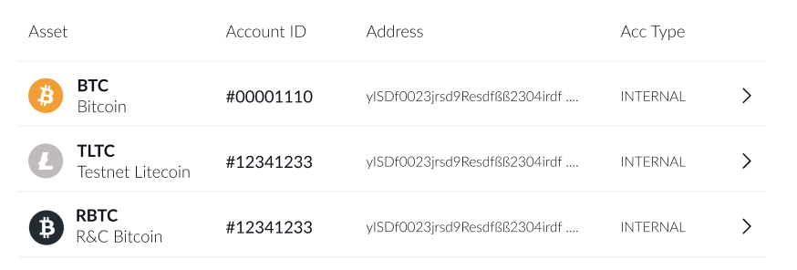

# Release notes




#### **🚀  New:**

* New currencies added:

| Ocean Protocol (OCEAN) | Chainlink (LINK)            |
| ---------------------- | --------------------------- |
| The Graph (GRT)        | Basic Attention Token (BAT) |
| Decentraland (MANA)    | Unibright (UBT)             |
| Uniswap (UNI)          | Enjin Coin (ENJ)            |
| The Sandbox (SAND)     | 0x (ZRX)                    |
| Loom Network (LOOM)    | Powerledger (POWR)          |
| SushiSwap (SUSHI)      | 1inch Network (1INCH)       |
| Compound (COMP)        | 
 
                 |

\
🌟  **Improved:**

* Front-end (UX) enhancements&#x20;
* New icons for tokens and assets




Here is a brief overview of the updates:

#### **🚀  New:**

* **New Currencies**
  * Energy Web Chain (EWT) integration
  * Cardano (ADA) integration
  * Binance Chain (BNB) integration
  * Stellar (XLM) integration
* **New Documentation**
  * Our online documentation and manuals platform is now live. Click [here](https://docs.riddleandcode.com/) to visit **RIDDLE\&CODE Documentation Hub**.
* **UI Updates**
  *   Current **Token Management Platform** version is now shown at the bottom right of the application.

      




#### **🚀  New:**

* New currencies added:
  * RBTC (Private Bitcoin Testnet)
  * Ripple(XRP), __ including Ripple Testnet TXRP
  * Liquid Network, __ including Liquid Testnet/Regtest

#### 🔧  **Fixes:**

* Issue with Approval Devices slowing down unexpectedly during an operation has been fixed

\
🌟  **Improved:**

* Windows Hotfix for Trusted Platform Module
* Front-end (UX) enhancements&#x20;
* New icons for tokens and assets

* Improved handling of errors
* Faster display of balances
* **Transaction Details** now include _Approvals_ and _Rejections_
* **Send Transaction** view highlights the most important details
* Improved tickers and performance on **Account Reconciliation**
* New Approval Device Firmware with improved performance and load/reaction time
* Communication between Approval Devices and the TMP interface is improved
* The account creation process has been streamlined



**🚀  New:**

* New currencies added:
  * Dash (DASH), including Dash Testnet
  * Bitcoin Cash (BCH), including BitcoinCash Testnet/Regtest



#### ****

